# AlphasparseWiki

## Table of Contents

- [项目简介](about:blank#page-intro)
- [架构概览](about:blank#page-arch-overview)
- [支持的稀疏矩阵格式](about:blank#page-matrix-formats)
- [构建指南](about:blank#page-build-guide)
- [Level 2 函数 (SpMV)](about:blank#page-api-level2)
- [Level 3 函数 (SpMM)](about:blank#page-api-level3)
- [CUDA 后端实现](about:blank#page-backend-cuda)
- [HIP 后端实现](about:blank#page-backend-hip)
- [CPU 后端实现 (ARM & Hygon)](about:blank#page-backend-cpu)
- [测试指南](about:blank#page-testing-guide)
- [工具脚本](about:blank#page-utils)

# 项目简介

AlphaSparse 是一个专为高性能计算设计的稀疏矩阵计算库。它旨在提供一套功能丰富、跨平台的稀疏 BLAS (Basic Linear Algebra Subprograms) 例程。该库支持多种主流硬件架构，包括 x86 (Hygon)、ARM 和 GPU (NVIDIA CUDA, Hygon DCU)，并为不同的稀疏矩阵存储格式提供了专门的内核实现，以实现最优性能。

该项目通过 CMake 进行构建管理，为不同平台提供了独立的构建配置，能够灵活地链接到特定于平台的后端库，如 Intel MKL、NVIDIA cuSPARSE 等。其 API 设计涵盖了从基本的向量操作到复杂的稀疏矩阵-矩阵乘法和求解器功能，支持多种数据类型，包括单精度/双精度浮点数和复数。

## 核心功能

AlphaSparse 库提供了一系列符合稀疏 BLAS 标准的计算例程。这些功能是库的核心，涵盖了 Level 2 和 Level 3 的主要操作。

### 主要运算例程

下表总结了该库支持的主要运算类型，这些运算通过在头文件中声明的各种内核函数来实现。

| 运算类别 | 函数前缀示例 | 描述 |
| --- | --- | --- |
| **通用矩阵-向量乘法** | `gemv_` | 计算 `y = alpha*A*x + beta*y`，支持转置和共轭转置。 |
| **对称矩阵-向量乘法** | `symv_` | 计算对称稀疏矩阵与向量的乘积。 |
| **厄米矩阵-向量乘法** | `hermv_` | 计算厄米稀疏矩阵与向量的乘积。 |
| **三角矩阵-向量乘法** | `trmv_` | 计算三角稀疏矩阵与向量的乘积。 |
| **三角方程求解** | `trsv_` / `spsv_` | 求解 `op(A)*x = alpha*y` 形式的三角系统。 |
| **通用矩阵-矩阵乘法** | `gemm_` / `spmm_` | 稀疏矩阵与稠密矩阵的乘法。 |
| **三角矩阵-矩阵求解** | `trsm_` / `spsm_` | 稀疏三角矩阵与稠密矩阵的求解。 |
| **稀疏矩阵-稀疏矩阵乘法** | `spgemm_` | 两个稀疏矩阵之间的乘法。 |
| **矩阵加法** | `add_` | 计算两个稀疏矩阵的和 `C = A + alpha*B`。 |

*Sources: include/alphasparse/kernel_plain/kernel_csr_c.h, include/alphasparse/kernel_plain/kernel_bsr_c.h, cuda/test/CMakeLists.txt:240-244*

### API 设计理念

AlphaSparse 的 API 遵循一套系统化的命名约定，以便清晰地表达函数的功能。

- **函数前缀**：通常包含数据类型（如 `c_` 代表单精度复数）和矩阵格式（如 `csr_`）。
- **操作名称**：核心部分是 BLAS 操作名（如 `gemv`, `trsm`）。
- **函数后缀**：
    - `_plain`: 表示通用的、无特殊优化的实现。
    - `_trans`: 表示矩阵转置操作。
    - `_conj`: 表示共轭操作。
- **平台特定前缀**：
    - `dcu_`: 表示针对 Hygon DCU 平台的实现。

此外，库的公开接口通过一系列枚举类型来定义操作参数，例如矩阵布局、操作类型、填充模式和对角线类型，这些定义可以在测试辅助头文件 `args.h` 中找到。

| 枚举类型 | 描述 |
| --- | --- |
| `alphasparse_layout_t` | 定义矩阵数据是按行主序还是列主序存储。 |
| `alphasparseOperation_t` | 定义矩阵操作，如非转置、转置或共轭转置。 |
| `alphasparse_fill_mode_t` | 定义矩阵的上三角或下三角部分被填充。 |
| `alphasparse_diag_type_t` | 定义矩阵对角线是单位对角线还是非单位对-角线。 |

*Sources: hip/test/include/args.h:20-26, include/alphasparse/kernel_dcu/kernel_csr_c_dcu.h:23-26, include/alphasparse/kernel_plain/kernel_dia_c.h:112-115*

## 支持的硬件平台与构建系统

该项目的一个关键特性是其跨平台能力。通过 CMake 构建系统，可以为多种硬件后端生成构建文件。

下面的流程图展示了项目的多平台构建流程。

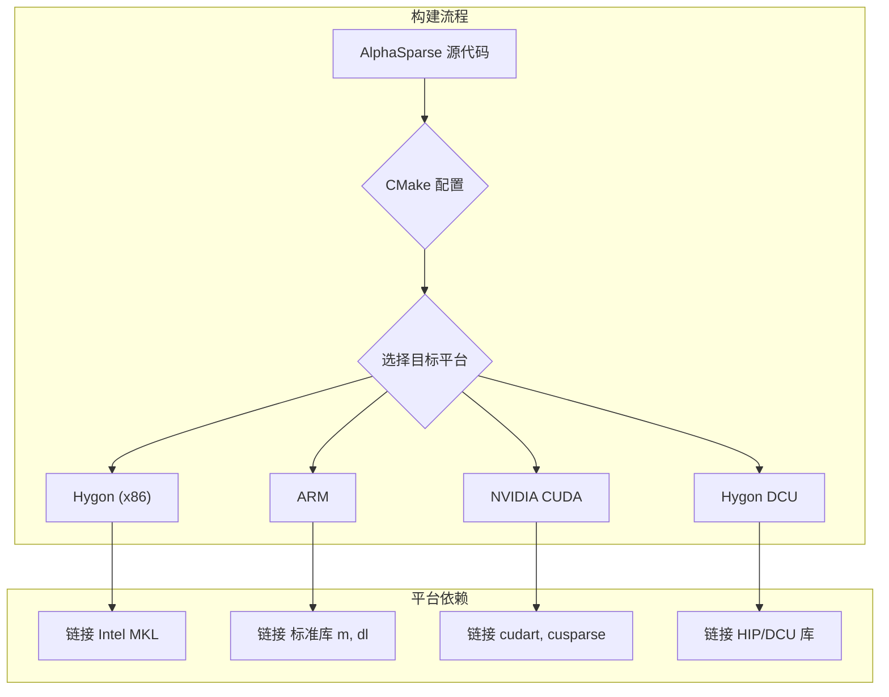
```mermaid
graph TD
  subgraph 构建流程
    A[AlphaSparse 源代码] --> B{CMake 配置}
    B --> C{选择目标平台}
    C --> D["Hygon (x86)"]
    C --> E["ARM"]
    C --> F["NVIDIA CUDA"]
    C --> G["Hygon DCU"]
  end

  subgraph 平台依赖
    D --> D_LIB[链接 Intel MKL]
    E --> E_LIB[链接 标准库 m, dl]
    F --> F_LIB[链接 cudart, cusparse]
    G --> G_LIB[链接 HIP/DCU 库]
  end

```

*Sources: hygon/test/CMakeLists.txt, arm/test/CMakeLists.txt, cuda/test/CMakeLists.txt, include/alphasparse/kernel_dcu/kernel_bsr_c_dcu.h*

### Hygon (x86)

针对 Hygon x86 平台，项目严重依赖 Intel Math Kernel Library (MKL) 来优化性能。CMake 配置文件明确指定了链接到 MKL 的多个组件。

```
# hygon/test/CMakeLists.txt:13-22target_link_libraries(${TEST_TARGET} PUBLIC    alphasparse
    # mkl_gnu_thread    # mkl_cdft_core    mkl_intel_lp64
    mkl_intel_thread
    mkl_core
    iomp5
    m
    dl
)
```

*Sources: hygon/test/CMakeLists.txt:13-22*

### ARM

ARM 平台的构建配置相对简单，不依赖于特定的商业数学库，而是链接到标准的数学库 (`m`) 和动态链接库 (`dl`)。这表明 ARM 后端可能包含一套独立的、平台优化的内核实现。

*Sources: arm/test/CMakeLists.txt:13-18*

### NVIDIA CUDA

为了利用 NVIDIA GPU 的并行计算能力，项目集成了对 CUDA 的支持。测试代码被编译为 CUDA 可执行文件，并链接到 `cudart` 和 `cusparse` 库。构建系统还允许通过 `CUDA_ARCH` 变量指定目标 GPU 架构，从而启用针对特定硬件（如支持 `bf16` 的 Ampere 架构）的优化。

```
# cuda/test/CMakeLists.txt:14-20target_link_libraries(${TEST_TARGET} PUBLIC    CUDA::cudart    CUDA::cudart_static    CUDA::cusparse    CUDA::cusparse_static    alphasparse
)
```

*Sources: cuda/test/CMakeLists.txt:14-20, 23-24*

### Hygon DCU

通过 `dcu_` 前缀的函数和 `hip/` 目录的存在，可以推断项目也支持基于 HIP (Heterogeneous-compute Interface for Portability) 的 Hygon DCU 平台。这使得代码能够在 AMD 和 Hygon 的 GPU 上运行，实现了代码的可移植性。

*Sources: include/alphasparse/kernel_dcu/kernel_bsr_c_dcu.h, hip/test/include/args.h*

## 支持的稀疏矩阵格式与数据类型

AlphaSparse 为多种常见的稀疏矩阵存储格式提供了支持，以适应不同稀疏模式和算法的需求。

### 矩阵格式

| 格式 | 头文件示例 | 描述 |
| --- | --- | --- |
| **CSR** (Compressed Sparse Row) | `kernel_csr_c.h` | 压缩行存储，适用于行操作。 |
| **CSC** (Compressed Sparse Column) | `kernel_csc_c.h` | 压缩列存储，适用于列操作。 |
| **COO** (Coordinate) | `kernel_coo_c.h` | 坐标格式，易于构造。 |
| **DIA** (Diagonal) | `kernel_dia_c.h` | 对角线格式，适用于对角结构化矩阵。 |
| **BSR** (Block Sparse Row) | `kernel_bsr_c.h` | 块压缩行存储，适用于具有块状非零模式的矩阵。 |
| **GEBSR** (General Block Sparse Row) | `kernel_gebsr_c.h` | 通用块稀疏行格式。 |

*Sources: include/alphasparse/kernel_plain/kernel_csr_c.h, include/alphasparse/kernel_plain/kernel_csc_c.h, include/alphasparse/kernel_plain/kernel_coo_c.h, include/alphasparse/kernel_plain/kernel_dia_c.h, include/alphasparse/kernel_plain/kernel_bsr_c.h, include/alphasparse/kernel/kernel_gebsr_c.h*

### 数据类型

该库支持多种精度和类型的数据，以满足不同计算场景的需求。

- **单精度复数**: `ALPHA_Complex8` (`c`)
- **双精度复数**: `ALPHA_Complex16` (`z`)
- **单精度浮点数**: `f32`
- **双精度浮点数**: `f64`
- **半精度浮点数**: `f16` (主要用于 CUDA)
- **Bfloat16**: `bf16` (主要用于 CUDA)
- **8位整数**: `i8` (主要用于 CUDA)

*Sources: include/alphasparse/kernel_plain/kernel_dia_c.h, include/alphasparse/kernel_plain/kernel_dia_z.h, cuda/test/CMakeLists.txt:25-44*

## 总结

AlphaSparse 是一个功能强大且高度可移植的稀疏线性代数库。它通过支持多种硬件平台、稀疏矩阵格式和数据类型，为科学与工程计算领域的开发人员提供了一个灵活而高效的工具。其模块化的设计和清晰的构建流程使其能够轻松适应不断发展的硬件环境，并为特定的计算任务提供优化的性能。

---

## 架构概览

### Related Pages

Related topics: [项目简介](about:blank#page-intro), [CUDA 后端实现](about:blank#page-backend-cuda), [HIP 后端实现](about:blank#page-backend-hip), [CPU 后端实现 (ARM & Hygon)](about:blank#page-backend-cpu)

- Relevant source files
    
    以下文件被用作生成此维基页面的上下文：
    
    - [hygon/test/CMakeLists.txt](hygon/test/CMakeLists.txt)
    - [arm/test/CMakeLists.txt](arm/test/CMakeLists.txt)
    - [cuda/test/CMakeLists.txt](cuda/test/CMakeLists.txt)
    - [hip/test/CMakeLists.txt](hip/test/CMakeLists.txt)
    - [cuda/test/include/args.h](cuda/test/include/args.h)
    - [hip/test/include/common.h](hip/test/include/common.h)
    - [include/alphasparse/kernel_dcu/kernel_csr_c_dcu.h](include/alphasparse/kernel_dcu/kernel_csr_c_dcu.h)
    - [cuda/kernel/level3/ac/MultiplyKernels.h](cuda/kernel/level3/ac/MultiplyKernels.h)

# 架构概览

Alphasparse 库是一个为高性能稀疏计算而设计的多平台线性代数库。其核心架构旨在提供一个统一的 API，同时在底层利用不同硬件平台的特定优化。该库支持多种硬件后端，包括 CPU（Hygon/x86-64, ARM）和 GPU（NVIDIA CUDA, AMD HIP/DCU），并通过分层的内核设计实现了代码的模块化和可扩展性。

该架构通过一个通用的测试框架来确保跨平台的一致性和正确性，该框架使用标准化的命令行参数来配置和执行测试。这种设计使得开发者能够专注于算法实现，而将平台适配的复杂性抽象到底层后端中。

## 多平台后端架构

Alphasparse 的核心设计理念是“一次编写，到处运行”，通过一个通用的 API 调度到针对特定硬件优化的后端实现。这种分层架构将用户应用程序与底层硬件实现解耦。

Sources: hygon/test/CMakeLists.txt, arm/test/CMakeLists.txt, cuda/test/CMakeLists.txt, hip/test/CMakeLists.txt

下面的图表演示了这种分层调度架构：

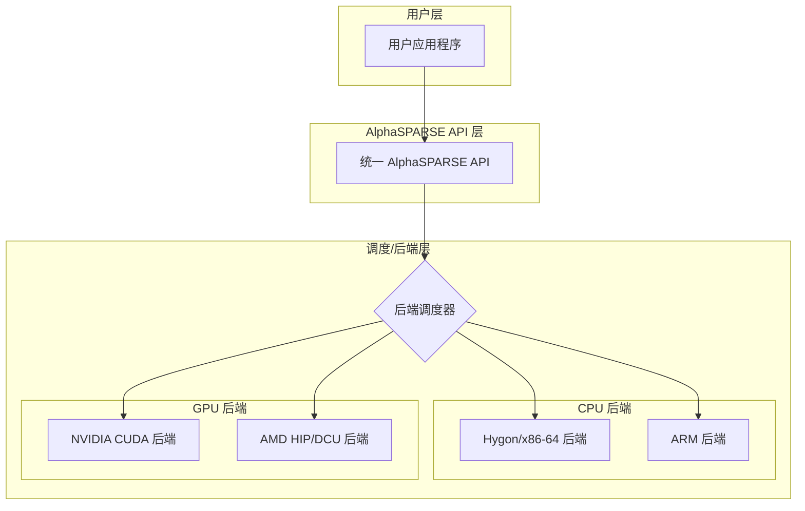
```mermaid
graph TD
    subgraph 用户层
        A[用户应用程序]
    end

    subgraph AlphaSPARSE API 层
        B[统一 AlphaSPARSE API]
    end

    subgraph 调度/后端层
        C{后端调度器}

        subgraph CPU 后端
            D[Hygon/x86-64 后端]
            E[ARM 后端]
        end

        subgraph GPU 后端
            F[NVIDIA CUDA 后端]
            G[AMD HIP/DCU 后端]
        end
    end

    A --> B
    B --> C
    C --> D
    C --> E
    C --> F
    C --> G
```

### CPU 后端

CPU 后端为通用计算平台提供了稀疏计算能力，并针对不同的 CPU 架构进行了适配。

**Hygon (x86-64)**

此后端主要针对 x86-64 架构，特别是 Hygon 处理器。为了最大化性能，它依赖于 Intel Math Kernel Library (MKL)。构建系统配置明确链接了 MKL 相关的库。

- `mkl_intel_lp64`
- `mkl_intel_thread`
- `mkl_core`
- `iomp5`

Sources: hygon/test/CMakeLists.txt:14-19

**ARM**

ARM 后端提供对 ARM 架构的支持。与 Hygon 后端不同，它不依赖于特定的商业数学库（如 MKL），而是链接标准系统库，表明其实现更为通用。

Sources: arm/test/CMakeLists.txt:14-17

### GPU 后端

GPU 后端利用主流 GPU 供应商提供的并行计算平台和专用稀疏计算库来实现高性能加速。

**NVIDIA CUDA**

该后端专为 NVIDIA GPU 设计，使用 CUDA 平台。它链接了 CUDA 运行时 (`cudart`) 和 cuSPARSE 库 (`cusparse`) 来执行稀疏计算任务。构建配置中还定义了目标 CUDA 架构 (`CUDA_ARCH`)，并为计算能力 8.0 及以上的架构启用了 BF16 数据类型的特定测试，显示了其对新硬件特性的支持。

Sources: cuda/test/CMakeLists.txt:12-16, cuda/test/CMakeLists.txt:20-22

**AMD HIP/DCU**

该后端为 AMD GPU 设计，使用 HIP (Heterogeneous-compute Interface for Portability) 作为编程接口。它链接了 `roc::hipsparse` 库。内核函数命名中频繁出现的 `dcu` 前缀（例如 `dcu_hermv_c_csr_n_hi_trans`）表明这些内核是为 AMD 的数据中心 GPU（DCU）设计的。

Sources: hip/test/CMakeLists.txt:30-35, include/alphasparse/kernel_dcu/kernel_csr_c_dcu.h:4

## 统一的测试框架

为了确保在所有支持的平台上功能正确且性能一致，项目采用了一个统一的测试框架。每个后端（`hygon`, `arm`, `cuda`, `hip`）的测试目录都包含一个 `CMakeLists.txt` 文件，其中定义了一个名为 `add_alphasparse_example` 的函数，用于以标准化的方式添加和配置测试可执行文件。

Sources: hygon/test/CMakeLists.txt:1, cuda/test/CMakeLists.txt:1

### 命令行参数解析

测试程序可以通过命令行参数进行灵活配置，这使得进行特定场景的测试和性能分析变得容易。`args.h` 头文件定义了解析这些参数的函数。

下表总结了一些关键的命令行参数及其作用：

| 参数类别 | 描述 | 默认值 | 来源 |
| --- | --- | --- | --- |
| `layout` | 定义密集矩阵的布局（行主序或列主序） | `ALPHA_SPARSE_LAYOUT_ROW_MAJOR` | `cuda/test/include/args.h:12` |
| `op` | 指定稀疏矩阵的操作类型（非转置、转置等） | `ALPHA_SPARSE_OPERATION_NON_TRANSPOSE` | `cuda/test/include/args.h:13` |
| `format` | 指定稀疏矩阵的存储格式 | `ALPHA_SPARSE_FORMAT_CSR` | `cuda/test/include/args.h:15` |
| `data_type` | 指定矩阵元素的数据类型 | `ALPHA_R_32F` | `cuda/test/include/args.h:16` |
| `iter` | 指定测试的迭代次数 | `1` | `cuda/test/include/args.h:14` |
| `warmup` | 指定预热运行的次数 | `1` | `cuda/test/include/args.h:11` |
| `check` | 是否进行结果正确性检查 | `false` | `cuda/test/include/args.h:9` |

Sources: cuda/test/include/args.h:8-40

### 后端库抽象与映射

在与特定供应商的库（如 hipSPARSE）进行交互或比较时，测试框架使用了一层抽象映射。`hip/test/include/common.h` 文件中定义了一系列 `std::map`，用于将 Alphasparse 内部的枚举类型转换为特定后端的枚举类型。这层抽象简化了测试代码，并使其更具可读性和可维护性。

Sources: hip/test/include/common.h

下面的图表演示了 `alphasparseOperation_t` 到 `hipsparseOperation_t` 的映射过程：

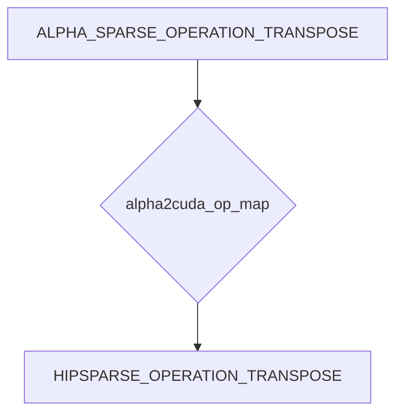
```mermaid
graph TD
    A[ALPHA_SPARSE_OPERATION_TRANSPOSE] --> B{alpha2cuda_op_map};
    B --> C[HIPSPARSE_OPERATION_TRANSPOSE];
```

下表展示了部分 Alphasparse 枚举到 hipSPARSE 枚举的映射关系：

| Alphasparse 枚举 | hipSPARSE 枚举 |
| --- | --- |
| `ALPHA_SPARSE_OPERATION_NON_TRANSPOSE` | `HIPSPARSE_OPERATION_NON_TRANSPOSE` |
| `ALPHA_SPARSE_OPERATION_TRANSPOSE` | `HIPSPARSE_OPERATION_TRANSPOSE` |
| `ALPHA_SPARSE_OPERATION_CONJUGATE_TRANSPOSE` | `HIPSPARSE_OPERATION_CONJUGATE_TRANSPOSE` |
| `ALPHA_SPARSE_FILL_MODE_UPPER` | `HIPSPARSE_FILL_MODE_UPPER` |
| `ALPHA_SPARSE_DIAG_NON_UNIT` | `HIPSPARSE_DIAG_TYPE_NON_UNIT` |

Sources: hip/test/include/common.h:46-75

## 内核函数命名约定

库中的内核函数遵循一套严格且信息丰富的命名约定，这使得仅从函数名就可以清晰地了解其功能。这种约定提高了代码的可读性和可维护性。

命名结构通常为：`[后端]_[功能]_[类型]_[格式]_[选项]`

下表详细解释了命名约定的各个部分：

| 部分 | 描述 | 示例 (`dcu_trmv_c_csr_n_lo_trans`) |
| --- | --- | --- |
| **后端** | 执行该内核的硬件后端。例如 `dcu` (AMD), `plain` (通用 CPU)。 | `dcu` |
| **功能** | 函数执行的主要操作。例如 `trmv` (三角矩阵向量乘), `gemm` (通用矩阵乘)。 | `trmv` |
| **类型** | 矩阵元素的数据类型。`c` 代表单精度复数, `z` 代表双精度复数。 | `c` |
| **格式** | 稀疏矩阵的存储格式。例如 `csr`, `bsr`, `dia`。 | `csr` |
| **选项** | 操作的具体参数。例如 `n` (非单位对角), `u` (单位对角), `lo` (下三角), `hi` (上三角), `trans` (转置)。 | `n_lo_trans` |

Sources: include/alphasparse/kernel_dcu/kernel_csr_c_dcu.h:13, include/alphasparse/kernel_dcu/kernel_bsr_c_dcu.h:13

## 总结

Alphasparse 库采用了一种高度模块化和可扩展的跨平台架构。通过将统一的 API 与针对特定硬件（x86, ARM, NVIDIA CUDA, AMD HIP）优化的后端实现相结合，该库能够在不同计算环境中提供高性能的稀疏线性代数运算。其统一的测试框架、清晰的内核命名约定以及对新硬件特性的支持，共同构成了一个健壮、易于维护和扩展的科学计算基础库。

---

## 支持的稀疏矩阵格式

### Related Pages

Related topics: [Level 2 函数 (SpMV)](about:blank#page-api-level2), [Level 3 函数 (SpMM)](about:blank#page-api-level3)

- Relevant source files
    
    以下文件被用作生成此维基页面的上下文：
    
    - `arm\kernel\level2\mv\trmv\trmv_bsr_u_hi_conj.hpp`
    - `arm\kernel\level2\mv\trmv\trmv_bsr_u_hi_trans.hpp`
    - `arm\test\CMakeLists.txt`
    - `arm\test\include\args.h`
    - `cuda\kernel\level3\ac\MultiplyKernels.h`
    - `cuda\test\CMakeLists.txt`
    - `cuda\test\include\args.h`
    - `dcu\test\include\args.h`
    - `hip\test\include\args.h`
    - `hygon\kernel\level2\mv\trmv\trmv_bsr_u_hi_conj.hpp`
    - `hygon\kernel\level2\mv\trmv\trmv_bsr_u_hi_trans.hpp`
    - `hygon\test\CMakeLists.txt`
    - `hygon\test\include\args.h`
    - `include\alphasparse\kernel\kernel_bsr_c.h`
    - `include\alphasparse\kernel\kernel_dia_c.h`
    - `include\alphasparse\kernel_plain\kernel_bsr_c.h`
    - `include\alphasparse\kernel_plain\kernel_csc_c.h`
    - `include\alphasparse\kernel_plain\kernel_csr_c.h`
    - `include\alphasparse\kernel_plain\kernel_csr_z.h`
    - `include\alphasparse\kernel_plain\kernel_dia_c.h`

# 支持的稀疏矩阵格式

AlphaSparse 库支持多种稀疏矩阵存储格式，以优化不同结构稀疏矩阵的性能。为特定应用选择合适的格式对于实现高效计算至关重要。该库的核心功能围绕着这些格式的特定内核实现，涵盖了从 Level 2 的矩阵向量运算到 Level 3 的矩阵矩阵运算。

默认的稀疏矩阵格式是 CSR（压缩稀疏行），这在各种后端（如 CUDA, HIP, Hygon）的测试配置文件中都有明确定义。然而，该库也为 CSC, BSR, DIA, COO 和 BELL 等格式提供了广泛的支持，尤其是在 CUDA 后端，其测试套件展示了对多种格式和数据类型的全面覆盖。

Sources: `hip/test/include/args.h:17`, `cuda/test/include/args.h:17`, `hygon/test/include/args.h:17`, `dcu/test/include/args.h:17`, `arm/test/include/args.h:17`, `include/alphasparse/kernel_plain/kernel_csr_c.h`, `include/alphasparse/kernel_plain/kernel_csc_c.h`, `include/alphasparse/kernel_plain/kernel_bsr_c.h`, `cuda/test/CMakeLists.txt`

## 格式概述

下表总结了 AlphaSparse 库中支持的主要稀疏矩阵格式。

| 格式 | 全称 | 描述 | 主要适用场景 |
| --- | --- | --- | --- |
| **CSR** | Compressed Sparse Row | 逐行压缩存储非零元素。这是库的默认格式。 | 通用稀疏矩阵，特别是当行操作频繁时。 |
| **CSC** | Compressed Sparse Column | 逐列压缩存储非零元素。 | 当列操作频繁时，例如在 `A^T * x` 类型的运算中。 |
| **BSR** | Block Sparse Row | 将矩阵划分为固定大小的块，并存储非零块。 | 具有密集子块模式的稀疏矩阵。 |
| **DIA** | Diagonal | 仅存储主对角线和次对角线上的非零元素。 | 对角矩阵或带状矩阵。 |
| **COO** | Coordinate | 存储每个非零元素的行索引、列索引和值。 | 构造稀疏矩阵时很方便，通常会转换为 CSR 或 CSC 以提高计算效率。 |
| **BELL** | Bellpack | 一种 BSR 的变体，用于在 SIMD/SIMT 架构上进行优化。 | 适用于特定硬件架构以优化内存访问模式。 |

Sources: `cuda/test/CMakeLists.txt`, `hygon/test/CMakeLists.txt`, `include/alphasparse/kernel_plain/kernel_csr_c.h`, `include/alphasparse/kernel_plain/kernel_csc_c.h`, `include/alphasparse/kernel_plain/kernel_bsr_c.h`, `include/alphasparse/kernel_plain/kernel_dia_c.h`

### 格式解析与配置

在测试框架中，可以通过命令行参数指定所使用的稀疏矩阵格式。`alphasparse_format_parse` 函数负责将字符串参数（如 “csr”）解析为内部的 `alphasparseFormat_t` 枚举值。

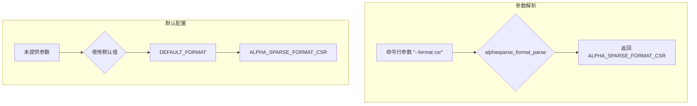
```mermaid
graph TD
    subgraph 参数解析
        A["命令行参数 &quot;--format csr&quot;"] --> B{"alphasparse_format_parse"}
        B --> C["返回 ALPHA_SPARSE_FORMAT_CSR"]
    end

    subgraph 默认配置
        D["未提供参数"] --> E{"使用默认值"}
        E --> F["DEFAULT_FORMAT"]
        F --> G["ALPHA_SPARSE_FORMAT_CSR"]
    end

```

**图 1**: 命令行中稀疏格式的解析流程。

`args.h` 头文件为不同后端定义了默认格式。

```c
// File: cuda/test/include/args.h:17-18#define DEFAULT_FORMAT ALPHA_SPARSE_FORMAT_CSR#define DEFAULT_DATA_TYPE ALPHA_R_32F
```

Sources: `cuda/test/include/args.h:17,27`, `hip/test/include/args.h:17,26`, `hygon/test/include/args.h:17,26`

## 主要格式详解

### CSR (Compressed Sparse Row)

CSR 是 AlphaSparse 中的首选格式。它使用三个数组来表示稀疏矩阵：
1. `values`: 存储非零元素的值。
2. `col_indices`: 存储每个非零元素对应的列索引。
3. `row_ptr`: 一个长度为 `(行数 + 1)` 的数组，`row_ptr[i]` 指示第 `i` 行第一个非零元素在 `values` 和 `col_indices` 数组中的起始位置。

该库为 CSR 格式提供了大量的内核函数，涵盖了单精度复数 (`c`) 和双精度复数 (`z`) 等多种数据类型。

```c
// File: include/alphasparse/kernel_plain/kernel_csr_c.h:11// alpha*A*x + beta*yalphasparseStatus_t gemv_c_csr_plain(const ALPHA_Complex8 alpha, const spmat_csr_c_t *A, const ALPHA_Complex8 *x, const ALPHA_Complex8 beta, ALPHA_Complex8 *y);
```

该格式在各个平台的测试文件中被广泛使用，例如 `spmm_csr_d_hygon_test.cpp` 和 `spmv_csr_r_f32_test.cu`。

Sources: `include/alphasparse/kernel_plain/kernel_csr_c.h:11`, `include/alphasparse/kernel_plain/kernel_csr_z.h:11`, `hygon/test/CMakeLists.txt:28`, `cuda/test/CMakeLists.txt:94`

### CSC (Compressed Sparse Column)

CSC 格式与 CSR 类似，但按列进行压缩。它对于需要高效列访问的操作非常有用。该库也为 CSC 格式提供了全面的内核支持。

```c
// File: include/alphasparse/kernel_plain/kernel_csc_c.h:11// alpha*A*x + beta*yalphasparseStatus_t gemv_c_csc_plain(const ALPHA_Complex8 alpha, const spmat_csc_c_t *A, const ALPHA_Complex8 *x, const ALPHA_Complex8 beta, ALPHA_Complex8 *y);
```

Hygon 和 ARM 平台的测试套件中包含了多个 CSC 格式的测试用例，如 `spmm_csc_s_hygon_test.cpp`。

Sources: `include/alphasparse/kernel_plain/kernel_csc_c.h:11`, `hygon/test/CMakeLists.txt:31`, `arm/test/CMakeLists.txt:31`

### BSR (Block Sparse Row)

BSR 格式适用于那些非零元素聚集形成密集块的稀疏矩阵。它通过存储非零块而不是单个元素来减少索引开销并提高计算强度。

内核实现（如 `trmv_bsr_u_hi_conj`）处理块状数据结构，并支持行主序（`ALPHA_SPARSE_LAYOUT_ROW_MAJOR`）和列主序（`ALPHA_SPARSE_LAYOUT_COLUMN_MAJOR`）的块内布局。

```cpp
// File: hygon/kernel/level2/mv/trmv/trmv_bsr_u_hi_conj.hpp:19    if (A->block_layout == ALPHA_SPARSE_LAYOUT_ROW_MAJOR){        // ...    }else if (A->block_layout == ALPHA_SPARSE_LAYOUT_COLUMN_MAJOR){        // ...    }
```

`kernel_bsr_c.h` 头文件定义了针对 BSR 格式的各种操作，包括通用矩阵向量乘法 (`gemv`)、对称矩阵向量乘法 (`symv`) 和厄米矩阵向量乘法 (`hermv`)。

Sources: `include/alphasparse/kernel/kernel_bsr_c.h:11-45`, `include/alphasparse/kernel_plain/kernel_bsr_c.h:8-42`, `hygon/kernel/level2/mv/trmv/trmv_bsr_u_hi_conj.hpp:19-74`, `arm/kernel/level2/mv/trmv/trmv_bsr_u_hi_conj.hpp:19-74`

### DIA (Diagonal)

DIA 格式专为对角矩阵和带状矩阵设计。它存储一个二维数组，其中每一行对应一个非零对角线，以及一个偏移数组，指示每个对角线相对于主对角线的位置。该格式的内核函数在 `kernel_dia_c.h` 中定义。

Sources: `include/alphasparse/kernel/kernel_dia_c.h`, `include/alphasparse/kernel_plain/kernel_dia_c.h`

### COO 和 BELL (仅限 CUDA)

CUDA 后端还支持 COO 和 BELL 格式。
- **COO (Coordinate)** 格式因其构造简单而在许多应用中很受欢迎。CUDA 测试套件包含大量 COO 测试，例如 `spmv_coo_r_f32_test.cu` 和 `spmm_coo_r_f32_test.cu`。
- **BELL (Bellpack)** 格式是 BSR 的一种变体，旨在优化特定硬件上的内存访问。CUDA 测试中也包含了 `spmm_bell_c_f32_test.cu` 等测试用例。

这两种格式的支持表明 AlphaSparse 致力于在高性能计算平台上提供针对特定硬件优化的解决方案。

Sources: `cuda/test/CMakeLists.txt:89, 201, 218`

## 总结

AlphaSparse 库通过支持多种稀疏矩阵格式，为不同类型的稀疏计算问题提供了灵活且高性能的解决方案。以 CSR 为默认格式，同时为 CSC、BSR、DIA 等提供强大的支持，并在 CUDA 等高性能后端上扩展到 COO 和 BELL 等专用格式，该库能够满足从通用计算到高度优化应用的需求。开发者可以根据其矩阵的特定结构和计算需求选择最合适的格式，以最大限度地提高性能。

---

## 构建指南

### Related Pages

Related topics: [测试指南](about:blank#page-testing-guide)

- Relevant source files
    
    以下文件被用作生成此维基页面的上下文：
    
    - [hygon/test/CMakeLists.txt](hygon/test/CMakeLists.txt)
    - [arm/test/CMakeLists.txt](arm/test/CMakeLists.txt)
    - [cuda/test/CMakeLists.txt](cuda/test/CMakeLists.txt)
    - [cuda/kernel/level3/ac/MultiplyKernels.h](cuda/kernel/level3/ac/MultiplyKernels.h)
    - [include/alphasparse/kernel_plain/kernel_csr_c.h](include/alphasparse/kernel_plain/kernel_csr_c.h)

# 构建指南

本文档提供了关于 AlphaSparse 库测试套件构建系统的详细技术说明。项目使用 CMake 进行构建管理，并为不同的目标硬件平台（包括 Hygon、ARM 和 CUDA）提供了定制的构建配置。构建脚本的核心是一个辅助函数，该函数根据目标平台处理依赖关系和编译选项，从而简化了测试可执行文件的创建过程。

## 核心构建函数：`add_alphasparse_example`

所有平台特定的 `CMakeLists.txt` 文件都定义并使用了一个名为 `add_alphasparse_example` 的 CMake 函数。这个函数封装了为单个测试源文件创建可执行目标所需的通用逻辑。

下面的流程图展示了该函数的主要执行步骤：

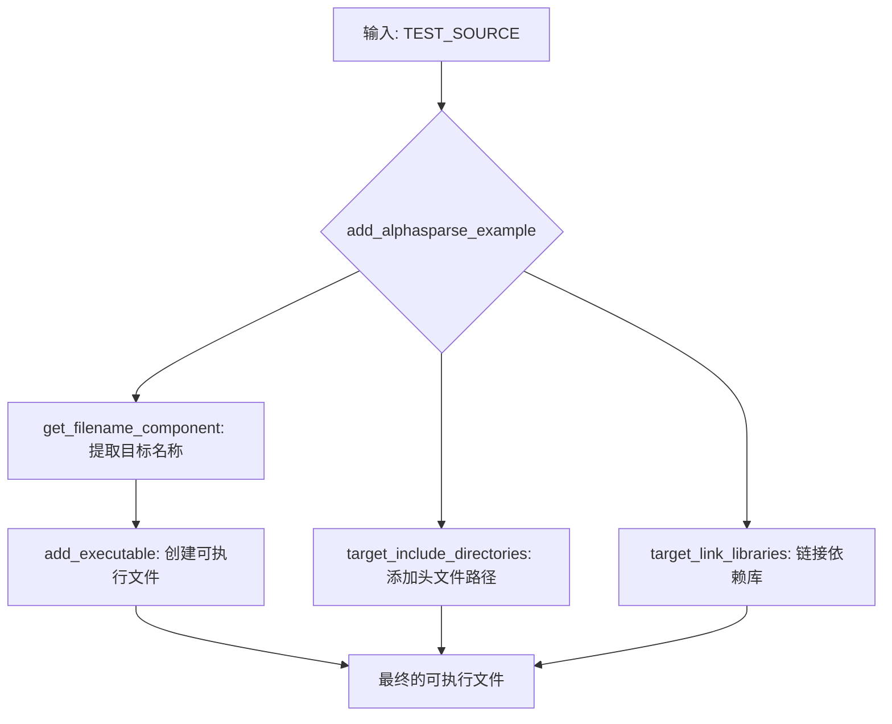
```mermaid
graph TD
    A[输入: TEST_SOURCE] --> B{add_alphasparse_example};
    B --> C[get_filename_component: 提取目标名称];
    C --> D[add_executable: 创建可执行文件];
    B --> E[target_include_directories: 添加头文件路径];
    B --> F[target_link_libraries: 链接依赖库];
    D --> G[最终的可执行文件];
    E --> G;
    F --> G;
```

*图 1: `add_alphasparse_example` 函数的通用工作流程*
Sources: hygon/test/CMakeLists.txt:1-24, arm/test/CMakeLists.txt:1-20, cuda/test/CMakeLists.txt:1-20

该函数的主要职责包括：
1. **目标命名**: 从源文件名中提取基本名称作为可执行目标名。
2. **创建可执行文件**: 使用 `add_executable` 命令从给定的源文件创建目标。
3. **包含目录**: 将项目顶层 `include` 目录添加到目标的包含路径中。
4. **链接库**: 将核心的 `alphasparse` 库以及平台特定的依赖项链接到目标。

每个平台的具体实现细节，尤其是在链接库和设置编译定义方面，有所不同。

## 平台特定构建配置

构建系统为三个主要平台提供了不同的配置：Hygon (x86_64)、ARM 和 CUDA。

### Hygon 平台

Hygon 平台的构建配置侧重于利用 Intel Math Kernel Library (MKL) 进行性能优化。

**链接器依赖**

除了核心的 `alphasparse` 库外，Hygon 目标还链接了以下 MKL 和系统库：

| 库名称 | 描述 |
| --- | --- |
| `alphasparse` | 核心 AlphaSparse 库 |
| `mkl_intel_lp64` | MKL LP64 接口层 |
| `mkl_intel_thread` | MKL 线程层 |
| `mkl_core` | MKL 核心计算库 |
| `iomp5` | Intel OpenMP 运行时库 |
| `m` | 标准数学库 |
| `dl` | 动态链接库 |

Sources: hygon/test/CMakeLists.txt:13-21

**构建的测试目标**

该平台构建了多个 Level 2 和 Level 3 功能的测试用例，例如：
- `mv_hygon_test`
- `sv_hygon_test`
- `mm_hygon_test`
- `spmm_csr_d_hygon_test`
- `trsm_hygon_test`

Sources: hygon/test/CMakeLists.txt:26-43

### ARM 平台

ARM 平台的构建配置相对简单，主要依赖于标准的系统库。

**链接器依赖**

ARM 目标链接的库如下：

| 库名称 | 描述 |
| --- | --- |
| `alphasparse` | 核心 AlphaSparse 库 |
| `m` | 标准数学库 |
| `dl` | 动态链接库 |

Sources: arm/test/CMakeLists.txt:13-17

**构建的测试目标**

ARM 平台构建的测试目标与 Hygon 平台类似，涵盖了 Level 2 和 Level 3 的各种稀疏计算功能。
- `mv_hygon_test`
- `sv_csr_s_hygon_test`
- `mm_hygon_test`
- `spmm_csc_s_hygon_test`
- `trsm_csr_s_hygon_test`

Sources: arm/test/CMakeLists.txt:22-40

### CUDA 平台

CUDA 平台的构建配置最为复杂，它处理了特定的 GPU 架构、编译定义和 CUDA 运行时库。

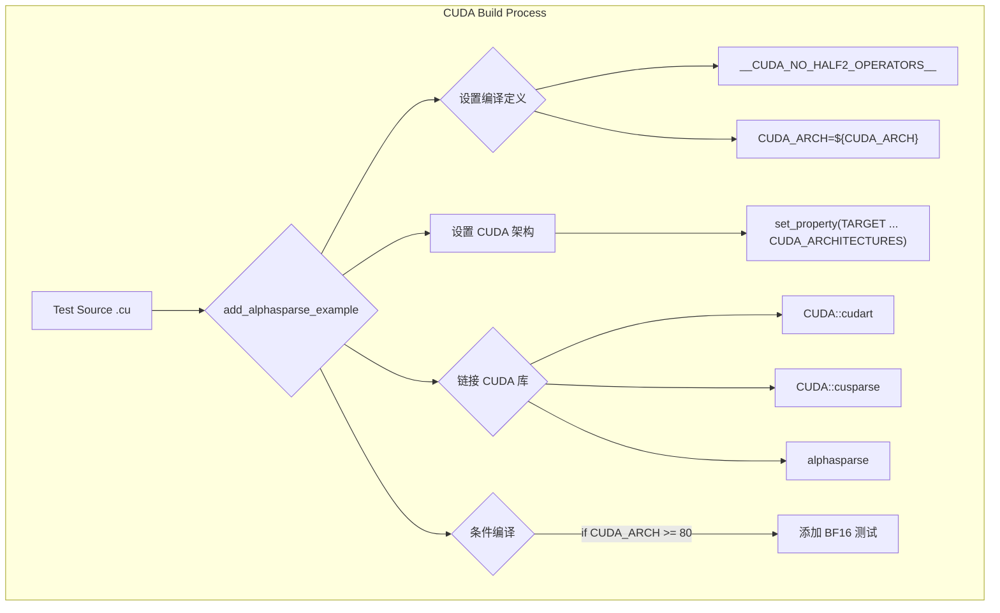
```mermaid
graph TD
    subgraph CUDA Build Process
        A[Test Source .cu] --> B{add_alphasparse_example};
        B --> C{设置编译定义};
        C --> D["__CUDA_NO_HALF2_OPERATORS__"];
        C --> E["CUDA_ARCH=${CUDA_ARCH}"];
        B --> F[设置 CUDA 架构];
        F --> G["set_property(TARGET ... CUDA_ARCHITECTURES)"];
        B --> H{链接 CUDA 库};
        H --> I[CUDA::cudart];
        H --> J[CUDA::cusparse];
        H --> K[alphasparse];
        B --> L{条件编译};
        L -- "if CUDA_ARCH >= 80" --> M[添加 BF16 测试];
    end
```

*图 2: CUDA 平台构建流程*
Sources: cuda/test/CMakeLists.txt:1-40

**关键配置**

- **编译定义**:
    - `__CUDA_NO_HALF2_OPERATORS__`: 禁用了 half2 类型的操作符重载。
    - `CUDA_ARCH`: 将 GPU 计算能力架构版本传递给编译器。
    Sources: cuda/test/CMakeLists.txt:4-5
- **CUDA 架构**: 使用 `set_property` 命令为目标明确设置 `CUDA_ARCHITECTURES` 属性，以确保为正确的 GPU 架构生成代码。
Sources: cuda/test/CMakeLists.txt:6
- **链接器依赖**:
    - `CUDA::cudart` / `CUDA::cudart_static`: CUDA 运行时库。
    - `CUDA::cusparse` / `CUDA::cusparse_static`: NVIDIA cuSPARSE 库。
    - `alphasparse`: 核心 AlphaSparse 库。
    Sources: cuda/test/CMakeLists.txt:13-18
- **条件编译**: 构建脚本会检查 `CUDA_ARCH` 变量。如果计算能力大于或等于 8.0（例如 NVIDIA Ampere 架构），它将额外编译支持 `bfloat16` 数据类型的测试用例。
Sources: cuda/test/CMakeLists.txt:23-40

**构建的测试目标**

CUDA 平台构建了大量的测试用例，涵盖了通用、Level 2、Level 3、预处理器和重排序等多个类别。部分示例如下：
- `generic/axpby_r_f32_test`
- `level2/spmv_csr_r_f32_test`
- `level3/spgemm_csr_r_f32_test`
- `precond/csric02_r32_test`
- `reordering/csrcolor_r32_test`

Sources: cuda/test/CMakeLists.txt:42-300

---

## Level 2 函数 (SpMV)

### Related Pages

Related topics: [Level 3 函数 (SpMM)](about:blank#page-api-level3), [支持的稀疏矩阵格式](about:blank#page-matrix-formats)

- Relevant source files
    
    以下文件被用作生成此维基页面的上下文：
    
    - [include/alphasparse/kernel_plain/kernel_csr_c.h](include/alphasparse/kernel_plain/kernel_csr_c.h)
    - [include/alphasparse/kernel_plain/kernel_bsr_c.h](include/alphasparse/kernel_plain/kernel_bsr_c.h)
    - [include/alphasparse/kernel_plain/kernel_csc_c.h](include/alphasparse/kernel_plain/kernel_csc_c.h)
    - [include/alphasparse/kernel_plain/kernel_dia_c.h](include/alphasparse/kernel_plain/kernel_dia_c.h)
    - [include/alphasparse/kernel/kernel_bsr_c.h](include/alphasparse/kernel/kernel_bsr_c.h)
    - [include/alphasparse/kernel/kernel_dia_c.h](include/alphasparse/kernel/kernel_dia_c.h)
    - [include/alphasparse/kernel/kernel_sky_c.h](include/alphasparse/kernel/kernel_sky_c.h)
    - [cuda/test/CMakeLists.txt](cuda/test/CMakeLists.txt)
    - [hip/test/include/args.h](hip/test/include/args.h)
    - [hygon/test/CMakeLists.txt](hygon/test/CMakeLists.txt)
    - [arm/test/CMakeLists.txt](arm/test/CMakeLists.txt)

# Level 2 函数 (SpMV)

Level 2 函数在 AlphaSPARSE 库中构成了稀疏矩阵与密集向量之间运算的核心。这些函数主要实现了稀疏矩阵-向量乘法（Sparse Matrix-Vector Multiplication, SpMV）及其变种，例如对称矩阵-向量乘法和三角求解。该模块旨在为多种硬件后端（包括 CPU、CUDA 和 HIP）提供统一的接口，同时支持多种稀疏矩阵存储格式和数据类型。

这些函数的设计遵循了 BLAS（Basic Linear Algebra Subprograms）的命名约定，为通用、对称、厄米和三角矩阵提供了丰富的操作集。通过详细的函数命名，用户可以精确控制运算的各个方面，如转置操作、填充模式和对角线类型。测试套件的结构也反映了这种多平台、多格式的支持，为每个后端和功能组合提供了专门的测试用例。

## API 概述

Level 2 函数的 API 围绕着几个核心的 SpMV 操作进行组织。这些操作通过函数名称中的前缀来区分，并支持多种参数来控制具体行为。

Sources: include/alphasparse/kernel_plain/kernel_csr_c.h, include/alphasparse/kernel_plain/kernel_bsr_c.h

### 主要函数类别

| 函数类别 | 描述 | 示例公式 |
| --- | --- | --- |
| `gemv` | 通用稀疏矩阵-向量乘法 | `y = alpha * op(A) * x + beta * y` |
| `symv` | 对称稀疏矩阵-向量乘法 | `y = alpha * A * x + beta * y` |
| `hermv` | 厄米稀疏矩阵-向量乘法 | `y = alpha * A * x + beta * y` |
| `trsv` | 三角稀疏系统求解 | `op(A) * x = alpha * y` |
| `spsv` | 稀疏向量的稀疏系统求解 | `op(A) * x = alpha * y` |

### 函数命名约定

AlphaSPARSE Level 2 函数的命名遵循一个系统化的模式，以便清晰地传达其功能。

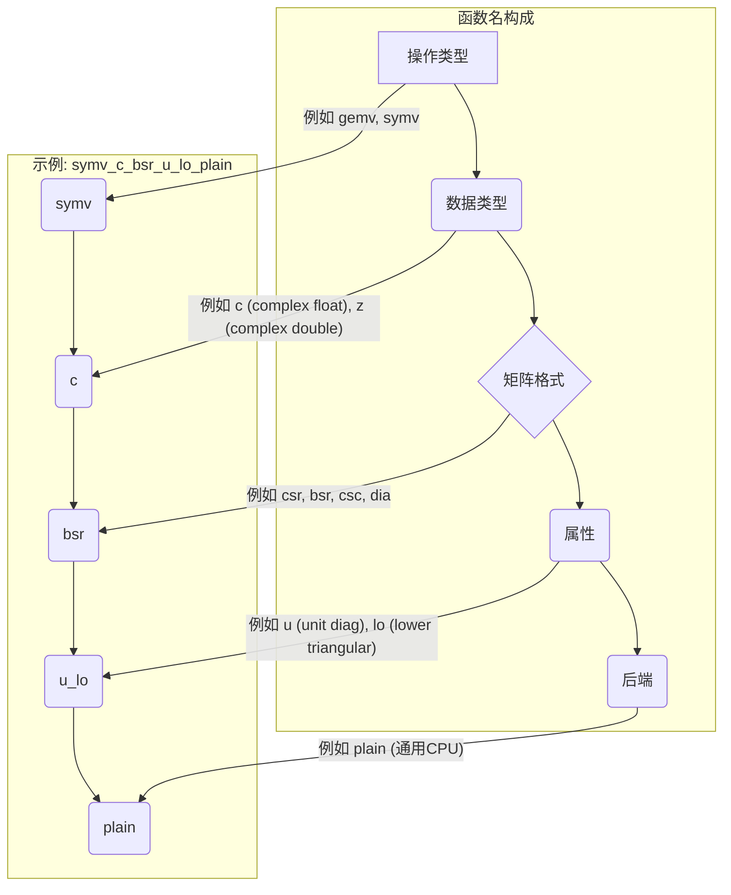
```mermaid
graph TD
    subgraph 函数名构成
        A[操作类型] --> B(数据类型)
        B --> C{矩阵格式}
        C --> D(属性)
        D --> E(后端)
    end

    subgraph 示例: symv_c_bsr_u_lo_plain
        F(symv) --> G(c)
        G --> H(bsr)
        H --> I("u_lo")
        I --> J(plain)
    end

    A -- "例如 gemv, symv" --> F
    B -- "例如 c (complex float), z (complex double)" --> G
    C -- "例如 csr, bsr, csc, dia" --> H
    D -- "例如 u (unit diag), lo (lower triangular)" --> I
    E -- "例如 plain (通用CPU)" --> J
```

这个图表展示了函数 `symv_c_bsr_u_lo_plain` 是如何由操作（对称向量乘）、数据类型（复数）、格式（BSR）、属性（单位对角线下三角）和后端（plain）等部分组成的。

Sources: include/alphasparse/kernel_plain/kernel_bsr_c.h:20, include/alphasparse/kernel_plain/kernel_csr_c.h:22

## 支持的参数与数据结构

为了执行 SpMV 操作，API 依赖于几个关键的枚举和结构体来定义矩阵的属性和操作类型。

### 操作类型 (Operation)

`alphasparseOperation_t` 枚举用于指定是否应对矩阵进行转置或共轭转置操作。

| 枚举值 | 描述 |
| --- | --- |
| `ALPHA_SPARSE_OPERATION_NON_TRANSPOSE` | 使用原始矩阵 A |
| `ALPHA_SPARSE_OPERATION_TRANSPOSE` | 使用 A 的转置 AT |
| `ALPHA_SPARSE_OPERATION_CONJUGATE_TRANSPOSE` | 使用 A 的共轭转置 AH |

Sources: hip/test/include/args.h:20

### 矩阵描述符

矩阵的属性，如对称性、三角性和对角线类型，通过 `alpha_matrix_descr` 结构体进行定义。测试框架提供了辅助函数来从命令行参数解析这些属性。

- **Matrix Type**: `alphasparse_matrix_type_t` (例如 `ALPHA_SPARSE_MATRIX_TYPE_GENERAL`, `ALPHA_SPARSE_MATRIX_TYPE_SYMMETRIC`)
- **Fill Mode**: `alphasparse_fill_mode_t` (例如 `ALPHA_SPARSE_FILL_MODE_LOWER`, `ALPHA_SPARSE_FILL_MODE_UPPER`)
- **Diag Type**: `alphasparse_diag_type_t` (例如 `ALPHA_SPARSE_DIAG_TYPE_UNIT`, `ALPHA_SPARSE_DIAG_TYPE_NON_UNIT`)

Sources: hip/test/include/args.h:23-25, hip/test/include/args.h:60

## 后端实现与测试

AlphaSPARSE 库为不同的硬件平台提供了专门的后端实现。每个后端都有其独立的测试套件，以确保在目标平台上的正确性和性能。

### 平台支持

从 `CMakeLists.txt` 文件中可以看出，项目为多个平台构建测试：
- **Hygon (x86)**: 链接 Intel MKL 库以获得优化的内核。
- **ARM**: 为 ARM 架构构建。
- **CUDA**: 针对 NVIDIA GPU，链接 `cudart` 和 `cusparse`。
- **HIP**: 针对 AMD GPU。
- **DCU**: 针对海光 DCU。

Sources: hygon/test/CMakeLists.txt:14-22, arm/test/CMakeLists.txt:13-17, cuda/test/CMakeLists.txt:14-19

### 测试框架

测试用例通过一个名为 `add_alphasparse_example` 的 CMake 函数添加。这允许为每个 Level 2 功能、数据类型和矩阵格式的组合轻松创建可执行文件。

例如，在 `cuda/test/CMakeLists.txt` 中，我们可以看到为不同精度的 CSR 格式 SpMV 添加了多个测试：

```
# cuda/test/CMakeLists.txt:100-103add_alphasparse_example(level2/spmv_csr_r_f32_test.cu)
add_alphasparse_example(level2/spmv_csr_r_f64_test.cu)
add_alphasparse_example(level2/spmv_csr_c_f32_test.cu)
add_alphasparse_example(level2/spmv_csr_c_f64_test.cu)
```

这些测试的可执行文件接受命令行参数来指定输入矩阵、迭代次数以及是否进行验证，这些参数由 `args.h` 头文件中的函数解析。

Sources: cuda/test/CMakeLists.txt:1, cuda/test/CMakeLists.txt:100-103, hip/test/include/args.h

### 测试执行流程

以下序列图说明了运行一个典型 SpMV 测试的流程。

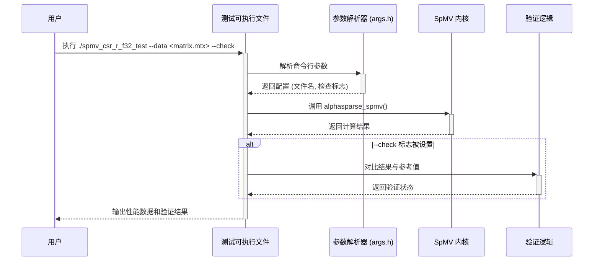
```mermaid
sequenceDiagram
    participant User as 用户
    participant TestBinary as 测试可执行文件
    participant ArgParser as 参数解析器 (args.h)
    participant SpMV_Kernel as SpMV 内核
    participant Verification as 验证逻辑

    User->>+TestBinary: 执行 ./spmv_csr_r_f32_test --data <matrix.mtx> --check
    TestBinary->>+ArgParser: 解析命令行参数
    ArgParser-->>-TestBinary: 返回配置 (文件名, 检查标志)
    TestBinary->>+SpMV_Kernel: 调用 alphasparse_spmv()
    SpMV_Kernel-->>-TestBinary: 返回计算结果
    alt --check 标志被设置
        TestBinary->>+Verification: 对比结果与参考值
        Verification-->>-TestBinary: 返回验证状态
    end
    TestBinary-->>-User: 输出性能数据和验证结果
```

这个流程展示了用户如何通过命令行与测试程序交互，程序如何解析参数，调用核心的 SpMV 内核，并根据需要执行结果验证。

Sources: hip/test/include/args.h:31, cuda/test/CMakeLists.txt:301-304

## 总结

AlphaSPARSE 的 Level 2 函数为稀疏矩阵-向量运算提供了一个功能强大且灵活的接口。通过其模块化的设计，它能够支持多种硬件后端、稀疏矩阵格式和数值类型。清晰的 API 和命名约定，加上全面的测试框架，确保了库的可靠性和在不同平台间的可移植性。这些 Level 2 函数是构建更高级稀疏计算算法（如迭代求解器）的基础。

---

## Level 3 函数 (SpMM)

### Related Pages

Related topics: [Level 2 函数 (SpMV)](about:blank#page-api-level2)

- Relevant source files
    
    以下是用于生成此维基页面的上下文文件：
    
    - [cuda/kernel/level3/csrspgemm_device_ac.h](cuda/kernel/level3/csrspgemm_device_ac.h)
    - [cuda/kernel/level3/ac/MultiplyKernels.h](cuda/kernel/level3/ac/MultiplyKernels.h)
    - [cuda/test/CMakeLists.txt](cuda/test/CMakeLists.txt)
    - [hygon/test/CMakeLists.txt](hygon/test/CMakeLists.txt)
    - [arm/test/CMakeLists.txt](arm/test/CMakeLists.txt)
    - [cuda/test/include/args.h](cuda/test/include/args.h)
    - [include/alphasparse/kernel_plain/kernel_csr_c.h](include/alphasparse/kernel_plain/kernel_csr_c.h)

# Level 3 函数 (SpMM)

Level 3 函数在 AlphaSparse 库中主要围绕稀疏矩阵与稀疏或稠密矩阵的乘法运算 (SpMM) 展开。这些函数是高性能计算中的关键组件，特别是在科学计算和机器学习领域。该库为包括 CUDA、Hygon (x86) 和 ARM 在内的多种硬件架构提供了 SpMM 的高度优化实现。

本文档主要概述了 SpMM 功能的架构，特别是其在 CUDA 平台上的 `ac-SpGEMM` 实现、跨平台测试策略以及相关的 API 定义。

## CUDA 架构 (ac-SpGEMM)

AlphaSparse 库包含一个针对 NVIDIA GPU 的高级稀疏矩阵-稀疏矩阵乘法 (SpGEMM) 实现，称为 `ac-SpGEMM`。该实现采用多阶段方法来高效计算两个稀疏矩阵的乘积，并能处理各种规模的矩阵。

Sources: cuda/kernel/level3/csrspgemm_device_ac.h, cuda/kernel/level3/ac/MultiplyKernels.h

### 执行流程

`ac-SpGEMM` 的执行流程主要分为两个阶段：计算（Compute）和合并（Merge）。计算阶段并行处理输入矩阵的行，生成中间结果“块”(chunks)。如果多个线程块处理了相同的输出行，则需要进入合并阶段，将这些中间结果合并成最终的行。

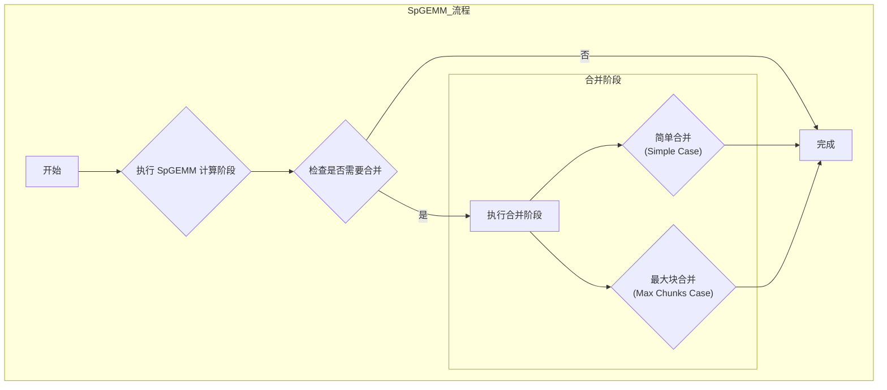
```mermaid
graph TD
    subgraph SpGEMM_流程
        A["开始"] --> B{"执行 SpGEMM 计算阶段"}
        B --> C{"检查是否需要合并"}
        C -->|是| D["执行合并阶段"]
        C -->|否| F["完成"]

        subgraph 合并阶段
            D --> D1{"简单合并\n(Simple Case)"}
            D --> D2{"最大块合并\n(Max Chunks Case)"}
        end

        D1 --> F
        D2 --> F
    end

```

**流程说明:**
1. **SpGEMM 计算阶段**: 内核 `h_computeSpgemmPart` 被调用，以并行方式计算部分乘积。每个线程块处理输入矩阵 `A` 的一部分行，并将结果存储在临时的块缓冲区中。
2. **合并阶段**:
* **简单合并 (Simple Case)**: 如果一个输出行的所有中间块可以完全加载到共享内存中，则调用 `h_mergeSharedRowsSimple` 内核进行合并。
* **最大块合并 (Max Chunks Case)**: 如果中间块数量超过了共享内存的容量，则调用 `h_mergeSharedRowsMaxChunks` 内核，通过更复杂的路径合并策略来处理。

Sources: cuda/kernel/level3/csrspgemm_device_ac.h:80-192

### 核心内核

`ac-SpGEMM` 的功能由 `AcSpGEMMKernels` 类中的一组 CUDA 内核模板提供。这些内核负责 SpGEMM 的不同阶段。

| 内核函数 | 描述 |
| --- | --- |
| `h_DetermineBlockStarts` | 确定每个线程块开始处理的非零元素（NNZ）的起始位置。 |
| `h_computeSpgemmPart` | SpGEMM 的主要计算阶段。计算部分积并将结果存储在块中。 |
| `h_mergeSharedRowsSimple` | 合并阶段的内核，用于处理可以放入共享内存的简单情况。 |
| `h_mergeSharedRowsMaxChunks` | 合并阶段的内核，用于处理需要多路径合并的复杂情况（块数量超过阈值）。 |

Sources: cuda/kernel/level3/ac/MultiplyKernels.h:56-104

### 优化与模板参数

`ac-SpGEMM` 实现利用 C++ 模板实现了高度的编译时配置和优化。内核调用根据输入矩阵的维度和特性选择不同的执行路径。

一个关键的优化是 `SORT_TYPE_MODE` 模板参数，它在 `h_computeSpgemmPart` 内核中用于根据矩阵列索引的大小选择不同的数据处理策略：
* **Case 0 (`SORT_TYPE_MODE = 0`)**: 当行和列索引都可以用 16 位表示时（`Arows < 0x10000 && Bcols < 0x10000`），使用此模式以获得最佳性能。
* **Case 1 (`SORT_TYPE_MODE = 1`)**: 当 B 矩阵的列数较少时，对局部行进行重映射以减少位数占用。
* **Case 2 (`SORT_TYPE_MODE = 2`)**: 通用情况，不进行特殊优化。

```cpp
// cuda/kernel/level3/csrspgemm_device_ac.h:83-128if (Arows < 0x10000 && Bcols < 0x10000){    // ...    spgemm.h_computeSpgemmPart<..., 0>(...);    // ...}else if (Bcols < (1 << LZCNT(nnz_per_thread*threads)) - 1){    // ...    spgemm.h_computeSpgemmPart<..., 1>(...);    // ...}else{    // ...    spgemm.h_computeSpgemmPart<..., 2>(...);    // ...}
```

Sources: cuda/kernel/level3/csrspgemm_device_ac.h:83-128

主要的模板参数包括：
| 参数 | 描述 |
| :— | :— |
| `NNZ_PER_THREAD` | 每个线程处理的非零元素数量。 |
| `THREADS` | 每个 CUDA 线程块中的线程数。 |
| `BLOCKS_PER_MP` | 每个流多处理器（SM）上调度的线程块数。 |
| `VALUE_TYPE` | 矩阵值的类型（如 float, double）。 |
| `INDEX_TYPE` | 矩阵索引的类型（如 int32_t）。 |
| `SORT_TYPE_MODE` | 如上所述的优化模式。 |

Sources: cuda/kernel/level3/ac/MultiplyKernels.h:69-75, cuda/kernel/level3/csrspgemm_device_ac.h:86-88

## 跨平台支持与测试

AlphaSparse 库通过在不同平台（CUDA, Hygon, ARM）上提供独立的测试套件来确保 SpMM 功能的正确性和性能。这些测试使用 CMake 进行构建和管理。

Sources: cuda/test/CMakeLists.txt, hygon/test/CMakeLists.txt, arm/test/CMakeLists.txt

### 测试用例编译

每个平台都有一个 `CMakeLists.txt` 文件，其中定义了一个名为 `add_alphasparse_example` 的函数，用于简化测试可执行文件的创建过程。

以下是 Hygon 平台 `CMakeLists.txt` 中该函数的定义和使用示例：

```
# hygon/test/CMakeLists.txt:1-19function(add_alphasparse_example TEST_SOURCE)
  get_filename_component(TEST_TARGET ${TEST_SOURCE} NAME_WE)
  include_directories(./include)
  add_executable(${TEST_TARGET} ${TEST_SOURCE})
  # ...  target_link_libraries(${TEST_TARGET} PUBLIC      alphasparse
      mkl_intel_lp64
      mkl_intel_thread
      mkl_core
      iomp5
      m
      dl
      )
endfunction()
add_alphasparse_example(level3/mm_hygon_test.cpp)
add_alphasparse_example(level3/spmm_hygon_test.cpp)
add_alphasparse_example(level3/spmm_csr_d_hygon_test.cpp)
```

此函数会自动处理目标命名、包含目录和库链接。通过调用此函数，可以轻松添加新的 SpMM 测试，例如 `spmm_hygon_test.cpp` 和 `spmm_csr_d_hygon_test.cpp`。

Sources: hygon/test/CMakeLists.txt:1-22, arm/test/CMakeLists.txt:1-17, cuda/test/CMakeLists.txt:1-16

### 链接库依赖

不同平台的 SpMM 实现依赖于不同的底层库。CMake 构建系统负责处理这些平台特定的链接要求。

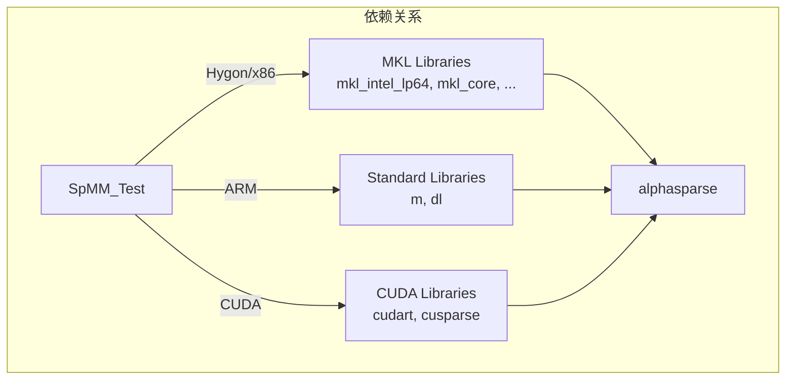
```mermaid
graph TD
    subgraph 依赖关系
        SpMM_Test -->|Hygon/x86| MKL[MKL Libraries<br>mkl_intel_lp64, mkl_core, ...];
        SpMM_Test -->|ARM| StandardLibs[Standard Libraries<br>m, dl];
        SpMM_Test -->|CUDA| CUDALibs[CUDA Libraries<br>cudart, cusparse];
        MKL --> alphasparse;
        StandardLibs --> alphasparse;
        CUDALibs --> alphasparse;
    end
```

| 平台 | 主要依赖库 |
| --- | --- |
| **Hygon (x86)** | `alphasparse`, `mkl_intel_lp64`, `mkl_intel_thread`, `mkl_core`, `iomp5` |
| **ARM** | `alphasparse`, `m`, `dl` |
| **CUDA** | `alphasparse`, `CUDA::cudart`, `CUDA::cusparse` |

Sources: hygon/test/CMakeLists.txt:10-17, arm/test/CMakeLists.txt:10-13, cuda/test/CMakeLists.txt:12-16

### 测试参数解析

测试可执行文件支持通过命令行参数进行配置，例如指定输入矩阵文件、数据类型、布局和操作类型。这些参数由 `args.h` 中定义的函数进行解析。

| 函数 | 描述 |
| --- | --- |
| `args_get_data_fileA` | 获取输入矩阵 A 的文件路径。 |
| `args_get_data_fileB` | 获取输入矩阵 B 的文件路径。 |
| `alpha_args_get_layout` | 获取矩阵的内存布局（行主序或列主序）。 |
| `alpha_args_get_transA` | 获取矩阵 A 的转置操作类型。 |
| `alpha_args_get_format` | 获取稀疏矩阵的存储格式（如 CSR, COO）。 |
| `alpha_args_get_data_type` | 获取矩阵元素的数据类型。 |

Sources: cuda/test/include/args.h:47-81, hip/test/include/args.h:44-71

## API 接口定义

AlphaSparse 为不同的数据类型和稀疏格式提供了统一的 API 风格。以下是 `add` 操作（一种广义的 SpMM）的函数声明示例，用于单精度复数 CSR 矩阵。

```c
// include/alphasparse/kernel_plain/kernel_csr_c.h:5alphasparseStatus_t add_c_csr_plain(const spmat_csr_c_t *A, const ALPHA_Complex8 alpha, const spmat_csr_c_t *B, spmat_csr_c_t **C);
```

此函数实现了 `C = alpha * A + B` 的操作，是 Level 3 稀疏计算的一部分。`_plain` 后缀表示这是一个通用的 C语言 实现，作为其他平台特定优化版本的基础或参考。

Sources: include/alphasparse/kernel_plain/kernel_csr_c.h:5, include/alphasparse/kernel_plain/kernel_bsr_c.h:3
Error: Invalid operation: The `response.text` quick accessor requires the response to contain a valid `Part`, but none were returned. The candidate’s [finish_reason](https://ai.google.dev/api/generate-content#finishreason) is 1.

---

## CUDA 后端实现

### Related Pages

Related topics: [架构概览](about:blank#page-arch-overview), [HIP 后端实现](about:blank#page-backend-hip)

- Relevant source files
    
    为生成此维基页面，使用了以下文件作为上下文：
    
    - [cuda/kernel/level3/csrspgemm_device_ac.h](cuda/kernel/level3/csrspgemm_device_ac.h)
    - [cuda/kernel/level3/ac/MultiplyKernels.h](cuda/kernel/level3/ac/MultiplyKernels.h)
    - [cuda/kernel/level3/csrspgemm_device_fast.h](cuda/kernel/level3/csrspgemm_device_fast.h)
    - [cuda/kernel/level3/fast/SparseDeviceMatrixCSROperations.h](cuda/kernel/level3/fast/SparseDeviceMatrixCSROperations.h)
    - [cuda/test/CMakeLists.txt](cuda/test/CMakeLists.txt)
    - [cuda/kernel/level3/fast/CudaComponentWise.h](cuda/kernel/level3/fast/CudaComponentWise.h)
    - [cuda/test/include/common.h](cuda/test/include/common.h)

# CUDA 后端实现

CUDA 后端为 Alphasparse 库提供了在 NVIDIA GPU 上执行高性能稀疏线性代数计算的能力。它利用 CUDA 编程模型来加速关键的稀疏计算任务，特别是稀疏矩阵-向量乘法 (SpMV) 和稀疏矩阵-矩阵乘法 (SpGEMM)。该后端包含多种算法实现，以适应不同稀疏矩阵的特性和计算需求，并通过精细的内存管理和并行化策略来最大化硬件利用率。

本文档详细介绍了 CUDA 后端的主要组件、核心算法实现、构建系统以及关键的内核函数。

## 稀疏矩阵-矩阵乘法 (SpGEMM)

SpGEMM 是 CUDA 后端的核心功能之一，它提供了两种主要的实现策略：一种是名为 `ac-SpGEMM` 的高级、多阶段算法，另一种是基于行长度分类的 `fast-SpGEMM` 算法。

### 高级 `ac-SpGEMM` 算法

`ac-SpGEMM` 是一种复杂但高效的算法，旨在处理各种规模和稀疏模式的矩阵乘法。它将计算过程分解为多个阶段，并通过动态内存管理和自适应的合并策略来处理中间结果。

`ac-SpGEMM` 的主要逻辑由 `AcSpGEMMKernels` 类封装，该类定义了算法各个阶段所需的 CUDA 内核。

Sources: cuda/kernel/level3/ac/MultiplyKernels.h:40-43, cuda/kernel/level3/csrspgemm_device_ac.h:121-124

### 算法流程

`ac-SpGEMM` 的执行流程是一个循环过程，首先计算中间结果（称为 “chunks”），然后根据需要合并这些 chunks，直到所有计算完成。如果中间内存不足，算法会自动重新分配并重启计算。

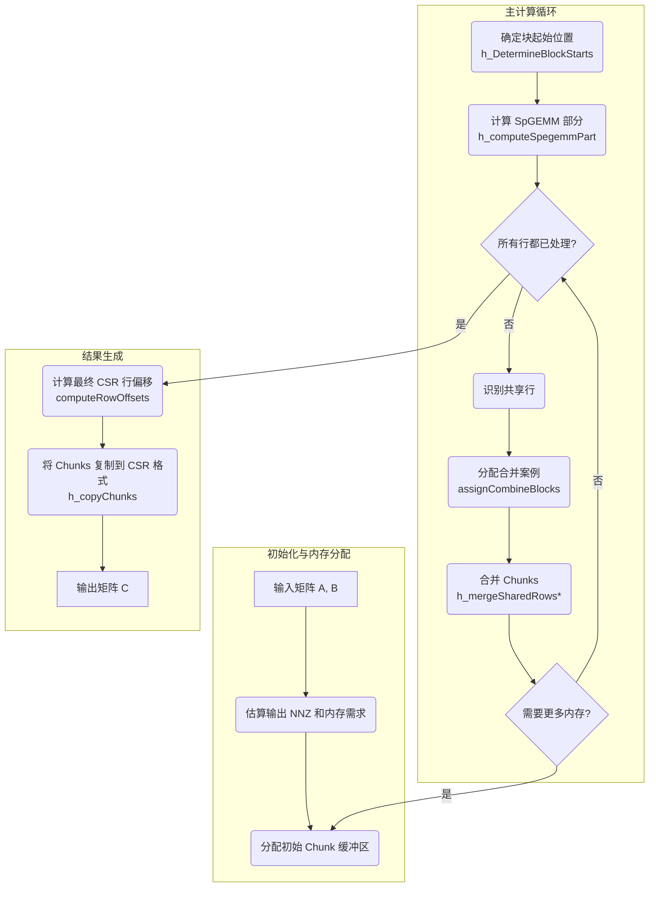
```mermaid
graph TD
    subgraph "初始化与内存分配"
        A[输入矩阵 A, B] --> B1(估算输出 NNZ 和内存需求);
        B1 --> B2(分配初始 Chunk 缓冲区);
    end

    subgraph "主计算循环"
        C1(确定块起始位置<br>h_DetermineBlockStarts) --> C2(计算 SpGEMM 部分<br>h_computeSpegemmPart);
        C2 --> C3{所有行都已处理?};
        C3 -- 否 --> C4(识别共享行);
        C4 --> C5(分配合并案例<br>assignCombineBlocks);
        C5 --> C6(合并 Chunks<br>h_mergeSharedRows*);
        C6 --> C7{需要更多内存?};
        C7 -- 是 --> B2;
        C7 -- 否 --> C3;
    end

    subgraph "结果生成"
        C3 -- 是 --> D1(计算最终 CSR 行偏移<br>computeRowOffsets);
        D1 --> D2(将 Chunks 复制到 CSR 格式<br>h_copyChunks);
        D2 --> E[输出矩阵 C];
    end
```

**图 1: `ac-SpGEMM` 算法执行流程图**
这个流程展示了从输入到最终输出矩阵的完整步骤，包括核心的计算和合并循环。

Sources: cuda/kernel/level3/csrspgemm_device_ac.h:352-475

### 关键内核函数

`AcSpGEMMKernels` 类定义了 `ac-SpGEMM` 算法的所有核心内核。

| 函数模板 | 描述 |
| --- | --- |
| `h_DetermineBlockStarts` | 确定每个 CUDA 块处理的非零元素的起始位置。 |
| `h_computeSpgemmPart` | SpGEMM 的主要计算阶段，生成中间结果 chunks。此内核根据矩阵维度选择不同的排序模式 (`SORT_TYPE_MODE`)。 |
| `h_mergeSharedRowsSimple` | 处理简单的合并情况，即一个行的所有中间结果可以放入共享内存中进行合并。 |
| `h_mergeSharedRowsMaxChunks` | 处理中等复杂的合并情况，当一个行的 chunks 数量超过简单合并的限制但在一个最大值 (`MERGE_MAX_CHUNKS`) 以内时使用。 |
| `h_mergeSharedRowsGeneralized` | 处理最复杂的合并情况，当 chunks 数量非常多时，采用通用的多路径合并策略。 |
| `h_copyChunks` | 在所有计算和合并完成后，将最终的 chunks 数据复制到标准的 CSR 矩阵格式中。 |
| `assignCombineBlocks` | 分析所有需要合并的行，并根据其 chunks 数量将它们分配给上述三种不同的合并内核。 |

Sources: cuda/kernel/level3/ac/MultiplyKernels.h:51-140

### 合并策略

`ac-SpGEMM` 的核心是其自适应的合并策略。在计算阶段之后，系统会识别出由多个 CUDA 块计算并产生部分结果的行（称为“共享行”）。这些行的部分结果需要被合并。`assignCombineBlocks` 函数根据每行产生的 chunks 数量，将其分类到三种不同的合并内核中。

- **Simple Case**: 适用于 chunks 总大小能放入共享内存的行。
- **Max Chunks Case**: 适用于 chunks 数量超过 Simple Case 但仍在预设阈值内的行。
- **Generalized Case**: 适用于 chunks 数量非常大的行，需要更复杂的合并逻辑。

这种分类旨在为不同复杂度的合并任务选择最高效的 CUDA 内核，从而优化整体性能。

Sources: cuda/kernel/level3/csrspgemm_device_ac.h:145-177, cuda/kernel/level3/ac/MultiplyKernels.h:136-138

### `fast-SpGEMM` 算法

`fast-SpGEMM` 是另一种 SpGEMM 实现，它采用了一种基于输入矩阵 A 的行长度（即每行的非零元素数量）进行分类和调度的策略。它将具有相似行长度的行分组，并为每个组调用专门优化的 CUDA 内核。

这种方法的核心思想是，对于具有不同非零元素数量的行，最佳的并行策略（例如，每个线程、warp 或块处理多少工作）是不同的。

Sources: cuda/kernel/level3/csrspgemm_device_fast.h

### 内核调度

该算法首先通过 `PredictCSize` 函数预测输出矩阵 C 的每行非零元素数量，然后根据输入矩阵 A 的行长度将行分组到 13 个队列中。每个队列对应一个特定的行长度范围。

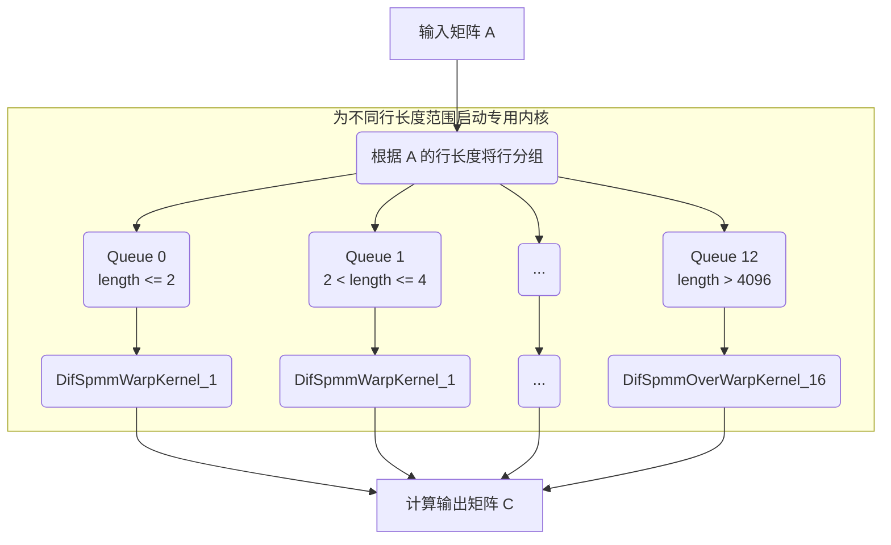
```mermaid
graph TD
    A[输入矩阵 A] --> B(根据 A 的行长度将行分组);
    subgraph "为不同行长度范围启动专用内核"
        B --> Q1("Queue 0<br>length <= 2");
        B --> Q2("Queue 1<br>2 < length <= 4");
        B --> Q3("...");
        B --> Q12("Queue 12<br>length > 4096");

        Q1 --> K1("DifSpmmWarpKernel_1");
        Q2 --> K2("DifSpmmWarpKernel_1");
        Q3 --> K3("...");
        Q12 --> K12("DifSpmmOverWarpKernel_16");
    end
    K1 --> C[计算输出矩阵 C];
    K2 --> C;
    K3 --> C;
    K12 --> C;
```

**图 2: `fast-SpGEMM` 基于行长度的内核调度**
此图说明了如何根据行中非零元素的数量将行分配到不同的队列，并为每个队列调用特定的 CUDA 内核。

Sources: cuda/kernel/level3/csrspgemm_device_fast.h:541-610, cuda/kernel/level3/csrspgemm_device_fast.h:150-219

### 内核类型

`fast-SpGEMM` 使用两种主要的内核范式：

1. **Warp Kernels** (`DifSpmmWarpKernel_*`): 每个 warp 负责计算输出矩阵的一行。这种策略适用于行长度较短的情况，因为一个 warp (通常是 32 个线程) 可以有效地并行处理该行的计算。
2. **Over-Warp Kernels** (`DifSpmmOverWarpKernel_*`): 多个 warp 甚至整个线程块协同计算输出矩阵的一行。这适用于行长度非常长的情况，单个 warp 不足以处理。

下表总结了部分内核及其对应的行长度。

| 内核函数 | 目标行长度 (A) | 并行策略 |
| --- | --- | --- |
| `DifSpmmWarpKernel_1<2>` | `<= 2` | 每个线程处理 1 个元素，2 个线程（一个 warp 的一部分）处理一行。 |
| `DifSpmmWarpKernel_1<32>` | `16 < length <= 32` | 每个线程处理 1 个元素，一个 warp (32 线程) 处理一行。 |
| `DifSpmmWarpKernel_8<32>` | `128 < length <= 256` | 每个线程处理 8 个元素，一个 warp (32 线程) 处理一行。 |
| `DifSpmmOverWarpKernel_16<32,16>` | `> 4096` | 多个 warp 协同处理一行，每个线程处理 16 个元素。 |

Sources: cuda/kernel/level3/csrspgemm_device_fast.h:222-359

## 核心 CUDA 操作

除了 SpGEMM 之外，CUDA 后端还实现了一系列基础的稀疏矩阵和向量操作。

Sources: cuda/kernel/level3/fast/SparseDeviceMatrixCSROperations.h

### 稀疏矩阵-向量乘法 (SpMV)

SpMV (Y = A*X) 是通过 `CudaMulSparseMatrixCSRVector` 函数实现的。其核心内核 `CudaMulSparseMatrixCSRVectorKernel` 采用 warp-per-row 的策略。

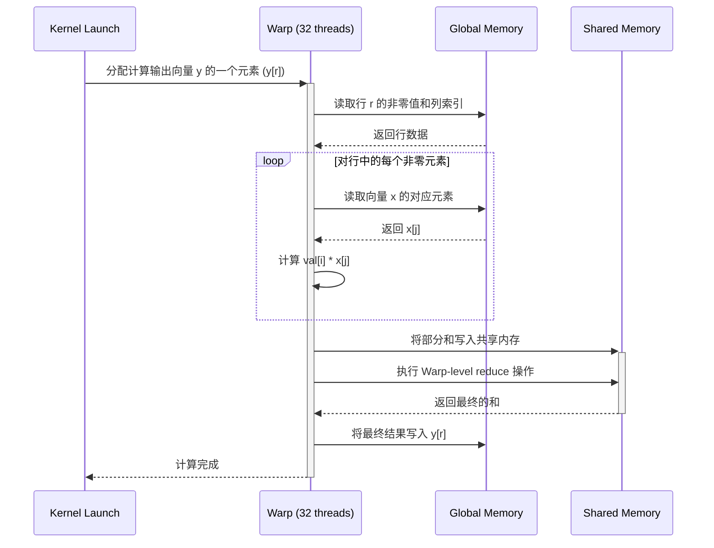
```mermaid
sequenceDiagram
    participant Kernel as Kernel Launch
    participant Warp as Warp (32 threads)
    participant GlobalMemory as Global Memory
    participant SharedMemory as Shared Memory

    Kernel->>+Warp: 分配计算输出向量 y 的一个元素 (y[r])
    Warp->>GlobalMemory: 读取行 r 的非零值和列索引
    GlobalMemory-->>Warp: 返回行数据
    loop 对行中的每个非零元素
        Warp->>GlobalMemory: 读取向量 x 的对应元素
        GlobalMemory-->>Warp: 返回 x[j]
        Warp->>Warp: 计算 val[i] * x[j]
    end
    Warp->>+SharedMemory: 将部分和写入共享内存
    Warp->>SharedMemory: 执行 Warp-level reduce 操作
    SharedMemory-->>-Warp: 返回最终的和
    Warp->>GlobalMemory: 将最终结果写入 y[r]
    Warp-->>-Kernel: 计算完成
```

**图 3: SpMV `CudaMulSparseMatrixCSRVectorKernel` 的执行序列**
该图展示了一个 CUDA warp 如何从全局内存加载数据，在共享内存中进行规约，并最终将结果写回，以计算输出向量的一个元素。

Sources: cuda/kernel/level3/fast/SparseDeviceMatrixCSROperations.h:182-205

### 其他操作

- **Transpose**: 提供了一个 `Transpose` 函数，用于计算 CSR 格式稀疏矩阵的转置。该过程涉及多个步骤：首先生成扩展的行索引，然后根据列索引对数据进行排序，最后重新计算转置矩阵的行偏移。
Sources: cuda/kernel/level3/fast/SparseDeviceMatrixCSROperations.h:142-167
- **Rank-One Update**: `RankOneUpdate` 函数用于更新稀疏矩阵的非零元素值，执行 `dst += scale * x * y^T` 操作。这是一个就地更新，仅修改 `dst` 中已经存在的非零元素。
Sources: cuda/kernel/level3/fast/SparseDeviceMatrixCSROperations.h:22-25, cuda/kernel/level3/fast/SparseDeviceMatrixCSROperations.h:169-180

## 构建与测试

CUDA 后端的测试用例是通过 `CMake` 进行管理的。`cuda/test/CMakeLists.txt` 文件定义了如何构建每个测试可执行文件。

一个名为 `add_alphasparse_example` 的 CMake 函数被用来简化测试目标的创建过程。

```
# cuda/test/CMakeLists.txtfunction(add_alphasparse_example TEST_SOURCE)
  get_filename_component(TEST_TARGET ${TEST_SOURCE} NAME_WE)
  add_executable(${TEST_TARGET} ${TEST_SOURCE})
  target_compile_definitions(${TEST_TARGET} PUBLIC __CUDA_NO_HALF2_OPERATORS__)
  target_compile_definitions(${TEST_TARGET} PUBLIC CUDA_ARCH=${CUDA_ARCH})
  set_property(TARGET ${TEST_TARGET} PROPERTY CUDA_ARCHITECTURES ${CUDA_ARCH})
  # ... include directories and link libraries ...  target_link_libraries(${TEST_TARGET} PUBLIC      CUDA::cudart      CUDA::cusparse      alphasparse
    )
endfunction()
```

这个函数处理了可执行文件的创建、CUDA 架构的设置以及与 CUDA 运行时、cuSPARSE 和 alphasparse 库的链接。

Sources: cuda/test/CMakeLists.txt:1-17

测试套件涵盖了广泛的功能，包括：

- **Level 2 BLAS**: `spmv_csr_r_f32_test.cu`, `spmv_coo_c_f64_test.cu`
- **Level 3 BLAS**: `spgemm_csr_r_f32_test.cu`, `spmm_coo_r_f64_test.cu`
- **不同数据类型**: 测试涵盖 `f16`, `bf16`, `f32`, `f64`, `i8` 以及复数类型。
- **预处理器和重排序**: `csric02_r32_test.cu`, `csrcolor_r32_test.cu`

BF16 数据类型的测试仅在 CUDA 计算能力大于等于 8.0 的设备上启用。

Sources: cuda/test/CMakeLists.txt:19-242

## 结论

Alphasparse 的 CUDA 后端提供了一个强大而灵活的稀疏计算框架。通过提供多种 SpGEMM 算法（如 `ac-SpGEMM` 和 `fast-SpGEMM`），它能够根据矩阵的特性选择最优的计算策略。结合高效的 SpMV 内核、丰富的辅助函数库以及全面的 CMake 测试系统，CUDA 后端确保了在 NVIDIA GPU 上的高性能和可靠性。这些设计共同构成了 Alphasparse 库在加速科学计算和机器学习等领域中稀疏线性代数任务的核心能力。

---

## HIP 后端实现

### Related Pages

Related topics: [架构概览](about:blank#page-arch-overview), [CUDA 后端实现](about:blank#page-backend-cuda)

- Relevant source files
    
    The following files were used as context for generating this wiki page:
    
    - [hip/test/CMakeLists.txt](hip/test/CMakeLists.txt)
    - [hip/test/include/common.h](hip/test/include/common.h)
    - [hip/kernel/level2/spsv_csr_n_lo_nnz_balance.h](hip/kernel/level2/spsv_csr_n_lo_nnz_balance.h)
    - [hip/kernel/level3/speck/spECK_HashLoadBalancer.h](hip/kernel/level3/speck/spECK_HashLoadBalancer.h)
    - [include/alphasparse/kernel_dcu/kernel_csr_c_dcu.h](include/alphasparse/kernel_dcu/kernel_csr_c_dcu.h)
    - [cuda/kernel/level3/ac/MultiplyKernels.h](cuda/kernel/level3/ac/MultiplyKernels.h)
    - [hip/test/include/args.h](hip/test/include/args.h)

# HIP 后端实现

### 引言

AlphaSPARSE 的 HIP 后端旨在为 AMD GPU 提供高性能的稀疏线性代数计算能力。该后端利用 HIP (Heterogeneous-compute Interface for Portability) 编程模型实现，确保了代码在 AMD 硬件平台上的高效执行。它为关键的稀疏 BLAS 例程提供了具体的实现，包括稀疏矩阵-向量乘法 (SpMV)、稀疏三角求解 (SpSV) 和稀疏矩阵-矩阵乘法 (SpGEMM)。为了确保计算的准确性，项目包含了一个全面的测试框架，该框架将 AlphaSPARSE HIP 内核的计算结果与 AMD 的 rocSPARSE (hipSPARSE) 库进行对比验证。

### 构建与测试

HIP 后端的构建和测试流程由 `CMake` 管理。测试代码位于 `hip/test/` 目录下，其 `CMakeLists.txt` 文件详细定义了测试用例的编译规则和依赖关系。

Sources: hip/test/CMakeLists.txt

### 测试通用组件

一组通用的源文件为所有 HIP 测试提供了基础功能，如命令行参数解析、I/O 操作和结果验证。

| 文件名 | 描述 |
| --- | --- |
| `args.hip` | 解析测试程序的命令行参数。 |
| `io.hip` | 负责从文件中读取矩阵数据。 |
| `check.hip` | 提供用于验证计算结果准确性的函数。 |
| `check_r.hip` | 针对实数类型的特定检查函数。 |
| `warmup.hip` | 提供 GPU 预热功能，以获得更准确的性能测量。 |

Sources: hip/test/CMakeLists.txt:3-9

### 测试用例构建流程

`CMakeLists.txt` 中的 `add_alphasparse_example` 函数封装了为每个测试源文件创建可执行文件的过程。此流程清晰地展示了测试程序的依赖关系和编译定义。

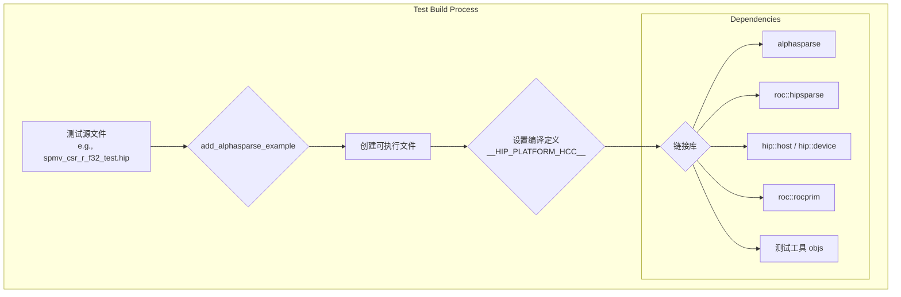
```mermaid
graph TD
    subgraph Test Build Process
        A[测试源文件<br/>e.g., spmv_csr_r_f32_test.hip] --> B{add_alphasparse_example};
        B --> C[创建可执行文件];
        C --> D{设置编译定义<br/>__HIP_PLATFORM_HCC__};
        D --> E{链接库};
        subgraph Dependencies
            E --> L1[alphasparse];
            E --> L2[roc::hipsparse];
            E --> L3[hip::host / hip::device];
            E --> L4[roc::rocprim];
            E --> L5[测试工具 objs];
        end
    end
```

*该图展示了如何通过 `add_alphasparse_example` 函数将一个 HIP 测试源文件编译成可执行文件，并链接所有必要的依赖库。*

Sources: hip/test/CMakeLists.txt:17-45

编译的测试目标涵盖了多个稀疏计算级别和数据类型，例如：
- `level2/spmv_csr_r_f32_test.hip`
- `level2/spsv_csr_r_f64_test_metrics.hip`
- `level3/spgemm_csr_r_f32_test.hip`
- `level3/spmm_csr_row_r_f64_test_hip_metrics.hip`

Sources: hip/test/CMakeLists.txt:59-75

### HIP/rocSPARSE 互操作性

为了验证 AlphaSPARSE HIP 实现的正确性，测试框架需要与 rocSPARSE (hipSPARSE) 库进行交互和结果比对。这是通过在一系列头文件中定义的枚举类型映射实现的，这些映射将 AlphaSPARSE 的 API 参数转换为 hipSPARSE 的等效参数。

`hip/test/include/common.h` 文件是实现这种互操作性的核心。它定义了从 AlphaSPARSE 枚举到 hipSPARSE 枚举的转换 `std::map`。

| AlphaSPARSE 枚举 | hipSPARSE 枚举 | 映射表 |
| --- | --- | --- |
| `alphasparseOperation_t` | `hipsparseOperation_t` | `alpha2cuda_op_map` |
| `alphasparse_fill_mode_t` | `hipsparseFillMode_t` | `alpha2cuda_fill_map` |
| `alphasparse_diag_type_t` | `hipsparseDiagType_t` | `alpha2cuda_diag_map` |
| `alphasparseOrder_t` | `hipsparseOrder_t` | `alpha2cuda_order_map` |
| `alphasparseDataType` | `hipDataType` | `alpha2cuda_datatype_map` |

*此表总结了用于在测试期间将 AlphaSPARSE API 调用转换为等效 rocSPARSE 调用的关键数据结构。*

Sources: hip/test/include/common.h:46-111

### 核心内核实现

AlphaSPARSE 的 HIP 后端包含针对不同稀疏操作级别优化的自定义内核。

### Level 2: SpSV (稀疏三角求解)

对于稀疏三角求解 (SpSV)，仓库实现了一种基于非零元 (NNZ) 负载均衡的算法，特别针对 CSR 格式的矩阵。该实现位于 `hip/kernel/level2/spsv_csr_n_lo_nnz_balance.h` 中。

该算法采用分析-求解 (Analysis-Solve) 两阶段方法：

1. **分析阶段 (`spsv_csr_n_lo_nnz_balance_analysis`)**:
    - 此阶段预处理矩阵以构建求解所需的依赖关系信息。
    - 它计算每行的“入度” (in-degree)，即在三角求解过程中，计算当前行之前需要完成计算的其他行的数量。
    - 可选地，该阶段可以对行进行重排序 (`REORDER` 模板参数) 以改善并行性。
2. **求解阶段 (`spsv_csr_n_lo_nnz_balance_solve_kernel`)**:
    - 这是一个 `__global__` HIP 内核，它为每个非零元启动一个线程。
    - 内核使用原子操作 (`atomicAdd`, `atomicSub`) 和内存栅栏 (`__threadfence`) 来安全地处理行之间的依赖关系。
    - 当一行的所有依赖项都计算完成后（即 `in_degree` 减至 1），负责对角线元素的线程将计算该行的最终解，并将其标记为完成，以解锁其他依赖于此行的计算。

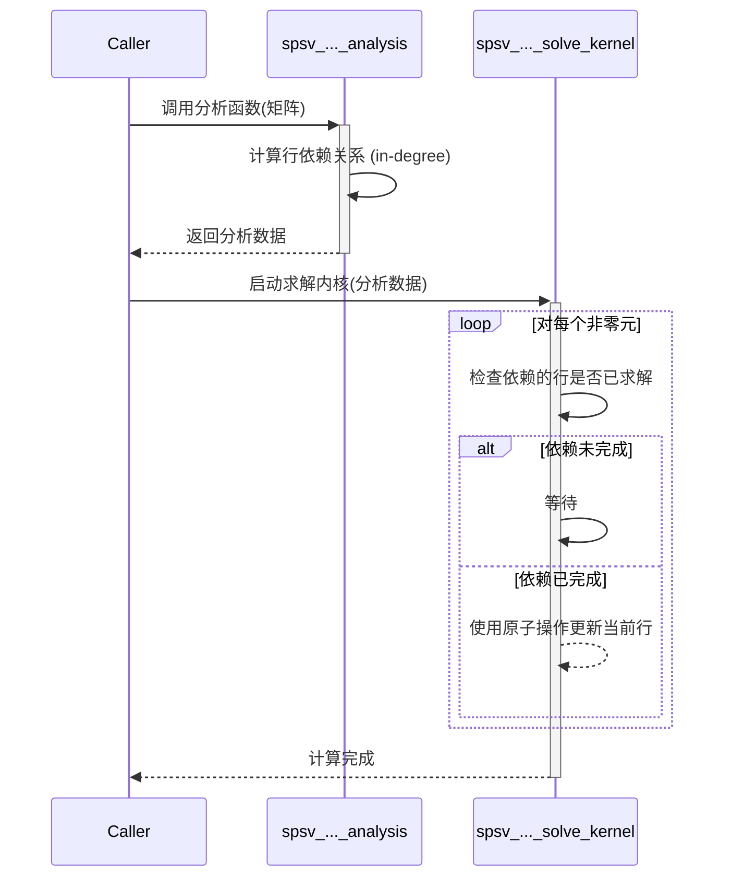
```mermaid
sequenceDiagram
    participant C as Caller
    participant A as spsv_..._analysis
    participant S as spsv_..._solve_kernel

    C->>+A: 调用分析函数(矩阵)
    A->>A: 计算行依赖关系 (in-degree)
    A-->>-C: 返回分析数据
    C->>+S: 启动求解内核(分析数据)
    loop 对每个非零元
        S->>S: 检查依赖的行是否已求解
        alt 依赖未完成
            S->>S: 等待
        else 依赖已完成
            S-->>S: 使用原子操作更新当前行
        end
    end
    S-->>-C: 计算完成
```

*此图描述了 SpSV 的分析-求解流程。分析阶段准备依赖信息，求解内核利用这些信息并通过原子操作并行地完成计算。*

Sources: hip/kernel/level2/spsv_csr_n_lo_nnz_balance.h:35-212

### Level 3: SpGEMM (稀疏矩阵-矩阵乘法)

项目为 SpGEMM 实现了多种复杂的 GPU 内核策略，旨在优化不同类型稀疏矩阵的乘法性能。

### spECK 负载均衡策略

`spECK` 是一种基于哈希的 SpGEMM 实现，其核心是高效的负载均衡。`spECK_HashLoadBalancer.h` 文件中的 `h_AssignHashSpGEMMBlocksToRowsOfSameSize` 函数实现了将具有相似计算负载（相似行长度）的行分组到同一个计算块（block）中的逻辑。

该过程如下：
1. **读取行长度**: `RowLengthReader` 结构从输入矩阵的行指针数组中读取每行的非零元数量。
2. **范围合并**: `CombineRangesOfSameSize` 仿函数将连续的、具有相同大小（或相似计算量）的行合并成一个工作范围。
3. **预扫描与分配**: `prescanArrayOrdered` 函数对所有行进行扫描，并使用合并逻辑来创建最终的块分配方案。
4. **消费者**: `BlockRangeConsumer` 将生成的块分配信息写入输出缓冲区。

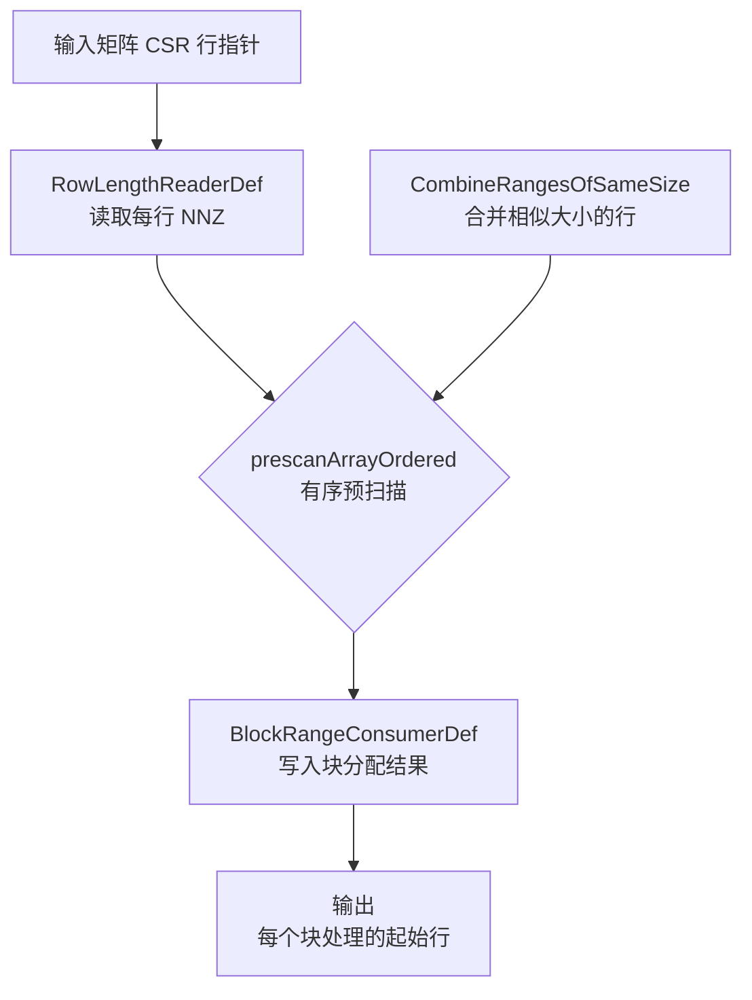
```mermaid
graph TD
    A[输入矩阵 CSR 行指针] --> B[RowLengthReaderDef<br>读取每行 NNZ];
    B --> C{prescanArrayOrdered<br>有序预扫描};
    D[CombineRangesOfSameSize<br>合并相似大小的行] --> C;
    C --> E[BlockRangeConsumerDef<br>写入块分配结果];
    E --> F[输出<br>每个块处理的起始行];
```

*此图展示了 spECK SpGEMM 中用于负载均衡的行分配流程，它将相似的行分组以优化 GPU 资源利用率。*

Sources: hip/kernel/level3/speck/spECK_HashLoadBalancer.h:73-120

### Ac-SpGEMM 内核

`cuda/kernel/level3/ac/MultiplyKernels.h` 文件定义了另一种 SpGEMM 实现（`AcSpGEMM`）的内核接口。尽管路径为 `cuda`，但其设计理念（如分阶段计算）通常适用于通用的 GPU 编程模型，包括 HIP。该文件定义了多个模板化的内核函数，暗示了一个多阶段的计算过程，可能包括：
- `h_DetermineBlockStarts`: 确定每个块的起始工作点。
- `h_computeSpgemmPart`: 执行 SpGEMM 的部分计算。
- `h_mergeSharedRowsSimple` / `h_mergeSharedRowsMaxChunks`: 合并由不同线程块或线程束计算的中间结果。

Sources: cuda/kernel/level3/ac/MultiplyKernels.h:60-96

### DCU/HIP API 接口

AlphaSPARSE 为 HIP 后端（在 AMD 生态系统中也称为 DCU）提供了一组明确的 C API。这些接口在 `include/alphasparse/kernel_dcu/` 目录下的头文件中声明。这些函数是上层应用与底层 HIP 内核之间的桥梁。

下表列出了一些代表性的 DCU API 函数：

| 函数 | 描述 | 源文件 |
| --- | --- | --- |
| `dcu_gemv_c_csr` | 通用稀疏矩阵-向量乘法 (GEMV)，用于 CSR 格式，单精度复数。 | `kernel_csr_c_dcu.h` |
| `dcu_hermv_c_csr_n_hi_trans` | Hermitian 矩阵-向量乘法，使用矩阵的上三角部分进行转置计算。 | `kernel_csr_c_dcu.h` |
| `dcu_trmv_c_csr_n_lo` | 三角矩阵-向量乘法，使用矩阵的下三角部分。 | `kernel_csr_c_dcu.h` |
| `dcu_gemm_z_bsr` | 通用稀疏矩阵-稠密矩阵乘法 (GEMM)，用于 BSR 格式，双精度复数。 | `kernel_bsr_z_dcu.h` |
| `dcu_trmv_z_bsr_u_hi_trans` | 单位三角矩阵-向量乘法，使用矩阵的上三角部分进行转置计算。 | `kernel_bsr_z_dcu.h` |

Sources: include/alphasparse/kernel_dcu/kernel_csr_c_dcu.h, include/alphasparse/kernel_dcu/kernel_bsr_z_dcu.h

### 结论

AlphaSPARSE 的 HIP 后端为 AMD GPU 提供了一套功能丰富且高性能的稀疏计算解决方案。通过 HIP 编程模型，它实现了与硬件无关的可移植性。后端结合了自定义的高级内核（如用于 SpSV 的依赖驱动内核和用于 SpGEMM 的复杂负载均衡策略）以及与 rocSPARSE 库的互操作性，确保了其功能的健壮性和准确性。清晰的 API 设计和完善的测试框架使其成为一个可靠的 GPU 加速稀疏计算库。

---

## CPU 后端实现 (ARM & Hygon)

### Related Pages

Related topics: [架构概览](about:blank#page-arch-overview)

- Relevant source files
    
    以下文件被用作生成此维基页面的上下文：
    
    - [hygon/test/CMakeLists.txt](hygon/test/CMakeLists.txt)
    - [arm/test/CMakeLists.txt](arm/test/CMakeLists.txt)
    - [hygon/kernel/CMakeLists.txt](hygon/kernel/CMakeLists.txt)
    - [hygon/kernel/level2/mv/symv/symv_bsr_u_lo_conj.hpp](hygon/kernel/level2/mv/symv/symv_bsr_u_lo_conj.hpp)
    - [arm/kernel/level2/mv/symv/symv_bsr_u_lo_conj.hpp](arm/kernel/level2/mv/symv/symv_bsr_u_lo_conj.hpp)

# CPU 后端实现 (ARM & Hygon)

本项目为不同的CPU架构（特别是Hygon x86-64和ARM）提供了独立的后端实现。这种方法允许利用每个平台特定的优化和库，以实现最佳性能。Hygon后端利用了Intel MKL库和特定的FMA（Fused Multiply-Add）汇编指令，而ARM后端则依赖于标准的数学和动态链接库。

两个后端共享部分高级C++内核代码的逻辑，但在构建过程、库依赖和底层优化方面存在显著差异。测试套件也针对每个架构分别配置，以确保在各自平台上的正确性和性能。

## 构建系统与依赖项

项目的构建系统使用CMake来管理不同CPU后端的编译和链接过程。通过在不同的目录（`hygon/` 和 `arm/`）中使用独立的`CMakeLists.txt`文件来处理特定于平台的配置。

Sources: hygon/test/CMakeLists.txt, arm/test/CMakeLists.txt

### 库链接

最显著的区别在于外部库的依赖关系。Hygon后端链接了Intel Math Kernel Library (MKL)，而ARM后端则使用标准的`m`和`dl`库。

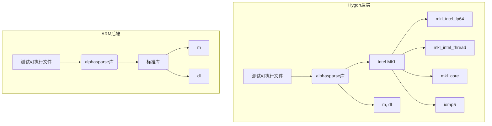
```mermaid
graph TD
    subgraph Hygon后端
        A[测试可执行文件] --> B(alphasparse库)
        B --> C[Intel MKL]
        C --> D[mkl_intel_lp64]
        C --> E[mkl_intel_thread]
        C --> F[mkl_core]
        C --> G[iomp5]
        B --> H[m, dl]
    end
    subgraph ARM后端
        X[测试可执行文件] --> Y(alphasparse库)
        Y --> Z[标准库]
        Z --> Z1[m]
        Z --> Z2[dl]
    end
```

*上图展示了Hygon和ARM后端测试程序的不同链接依赖关系。*

下表总结了链接库的差异：

| 库 | Hygon (`hygon/test/CMakeLists.txt`) | ARM (`arm/test/CMakeLists.txt`) | 描述 |
| --- | --- | --- | --- |
| `alphasparse` | ✓ | ✓ | 项目核心稀疏计算库 |
| `mkl_intel_lp64` | ✓ | ✗ | Intel MKL 64位整数接口层 |
| `mkl_intel_thread` | ✓ | ✗ | Intel MKL OpenMP线程层 |
| `mkl_core` | ✓ | ✗ | MKL核心计算库 |
| `iomp5` | ✓ | ✗ | Intel OpenMP运行时库 |
| `m` | ✓ | ✓ | 标准数学库 |
| `dl` | ✓ | ✓ | 动态链接库 |

Sources: hygon/test/CMakeLists.txt:14-23, arm/test/CMakeLists.txt:13-17

### 测试目标

两个平台都使用一个名为`add_alphasparse_example`的CMake函数来定义和构建测试可执行文件。尽管测试文件的名称在两个平台间大部分相同（例如`level3/mm_hygon_test.cpp`），但它们是为各自的平台独立编译和链接的。

**Hygon 测试目标示例:**

```
add_alphasparse_example(level2/mv_hygon_test.cpp)
add_alphasparse_example(level3/mm_hygon_test.cpp)
add_alphasparse_example(level3/spmm_csr_d_hygon_test.cpp)
```

Sources: hygon/test/CMakeLists.txt:28-45

**ARM 测试目标示例:**

```
add_alphasparse_example(level2/mv_hygon_test.cpp)
add_alphasparse_example(level3/mm_hygon_test.cpp)
add_alphasparse_example(level3/spmm_csr_d_hygon_test.cpp)
```

Sources: arm/test/CMakeLists.txt:22-39

## 内核实现

Hygon后端的内核实现包含C++源文件和特定于x86架构的汇编（.S）文件，以实现极致优化。

Sources: hygon/kernel/CMakeLists.txt

### Hygon内核源文件

Hygon内核的源代码在`hygon/kernel/CMakeLists.txt`中定义。它分为C++实现和汇编实现。

**C++ 源文件 (`alphasparse_source`):**
- `kernel/level1/alphasparse_axpy.cpp`
- `kernel/level2/alphasparse_mv.cpp`
- `kernel/level2/alphasparse_trsv.cpp`
- `kernel/level3/alphasparse_mm.cpp`
- `kernel/level3/alphasparse_spmm.cpp`
- …等等

Sources: hygon/kernel/CMakeLists.txt:1-17

**汇编源文件 (`ASM_SOURCES`):**
这些文件提供了针对特定操作（如GEMV）的手写优化。
- `kernel/level2/mv/gemv/csrmv/gemv_csr_serial_fma_c8_u2.S`
- `kernel/level2/mv/gemv/csrmv/gemv_csr_serial_fma_fp32_u8_ext.S`
- `kernel/level2/mv/gemv/csrmv/gemv_csr_serial_fma_fp64_u4.S`
- `kernel/level2/mv/gemv/ellmv/ellsgemv_fma128.S`
- …等等

Sources: hygon/kernel/CMakeLists.txt:20-33

### C++ 内核代码比较

通过比较`symv_bsr_u_lo_conj.hpp`文件可以看出，Hygon和ARM后端目前共享相同的高级C++内核代码。两个文件中的逻辑是完全一致的，这表明在某些情况下，代码是跨平台可移植的，而性能差异主要来自于底层库和汇编级别的优化。

以下是该内核中核心计算循环的简化流程：

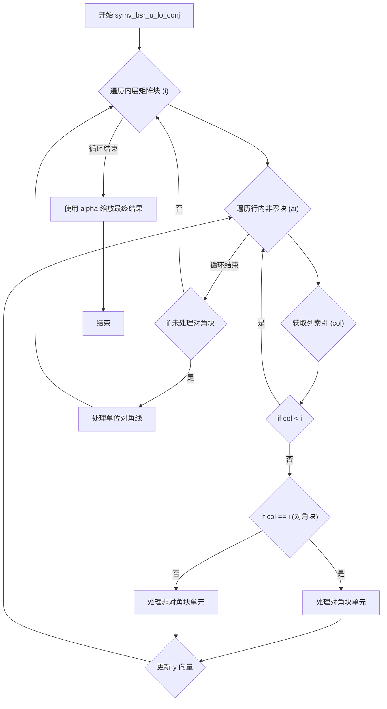
```mermaid
graph TD
    A["开始 symv_bsr_u_lo_conj"] --> B{"遍历内层矩阵块 (i)"}
    B --> C{"遍历行内非零块 (ai)"}
    C --> D{"获取列索引 (col)"}
    D --> E{"if col < i"}
    E -- "是" --> C
    E -- "否" --> F{"if col == i (对角块)"}
    F -- "是" --> G["处理对角块单元"]
    F -- "否" --> H["处理非对角块单元"]
    G --> I
    H --> I{"更新 y 向量"}
    I --> C

    C -- "循环结束" --> J{"if 未处理对角块"}
    J -- "是" --> K["处理单位对角线"]
    K --> B
    J -- "否" --> B

    B -- "循环结束" --> L["使用 alpha 缩放最终结果"]
    L --> M["结束"]

```

*上图展示了`symv_bsr_u_lo_conj.hpp`中处理对称块稀疏矩阵向量乘法的通用逻辑。*

代码片段示例（Hygon与ARM相同）：

```cpp
// hygon/kernel/level2/mv/symv/symv_bsr_u_lo_conj.hppfor(ALPHA_INT i = 0; i < m_inner; ++i){    ALPHA_INT m_s = i*bs;    for(ALPHA_INT ai = A->row_data[i]; ai < A->row_data[i+1]; ++ai)    {        const ALPHA_INT col = A->col_data[ai];        if(col < i)        {            continue;        }        else if(col == i)        {            diag_block = 1;            // ... 对角块处理 ...        }        else        {            // ... 非对角块处理 ...        }    }    if (diag_block == 0){        // ... 单位对角线处理 ...    }}
```

Sources: hygon/kernel/level2/mv/symv/symv_bsr_u_lo_conj.hpp:34-80, arm/kernel/level2/mv/symv/symv_bsr_u_lo_conj.hpp:34-80

## 总结

该项目的CPU后端实现针对Hygon和ARM平台采取了不同的策略。Hygon后端通过链接Intel MKL并使用手写的汇编代码进行了深度优化。相比之下，ARM后端依赖于更通用的库，但在高级C++内核层面与Hygon后端共享代码。这种模块化的设计使得为不同硬件平台提供专门优化成为可能，同时最大限度地提高了代码的复用性。构建系统通过CMake精确控制每个后端的编译和链接过程，确保了平台的独立性和正确性。

---

## 测试指南

### Related Pages

Related topics: [构建指南](about:blank#page-build-guide)

- Relevant source files
    
    此维基页面的内容生成参考了以下文件：
    
    - [hygon/test/CMakeLists.txt](hygon/test/CMakeLists.txt)
    - [arm/test/CMakeLists.txt](arm/test/CMakeLists.txt)
    - [cuda/test/CMakeLists.txt](cuda/test/CMakeLists.txt)
    - [cuda/kernel/level3/csrspgemm_device_ac.h](cuda/kernel/level3/csrspgemm_device_ac.h)
    - [cuda/kernel/level3/ac/MultiplyKernels.h](cuda/kernel/level3/ac/MultiplyKernels.h)

# 测试指南

AlphaSparse 库包含一个全面的测试套件，旨在确保在多个硬件架构（包括 Hygon x86、ARM 和 NVIDIA CUDA）上的正确性和性能。该测试框架使用 CMake 进行管理，为添加和构建测试用例提供了一个统一的接口。本指南概述了测试系统的结构、特定平台的配置以及测试覆盖范围。

## 测试构建系统

项目使用 CMake 来自动化测试可执行文件的编译和链接过程。核心机制是一个名为 `add_alphasparse_example` 的自定义 CMake 函数，该函数封装了为不同平台添加测试的通用逻辑。

Sources: hygon/test/CMakeLists.txt:1-26, arm/test/CMakeLists.txt:1-20, cuda/test/CMakeLists.txt:1-20

### `add_alphasparse_example` 函数

此函数是向构建系统添加新测试用例的标准方法。它处理从源文件名派生目标名称、设置包含目录和链接所需库等任务。

下面的流程图说明了该函数的操作：

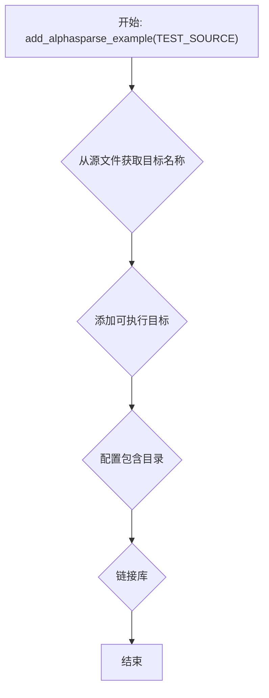
```mermaid
graph TD
    A["开始: add_alphasparse_example(TEST_SOURCE)"] --> B{"从源文件获取目标名称"}
    B --> C{"添加可执行目标"}
    C --> D{"配置包含目录"}
    D --> E{"链接库"}
    E --> F["结束"]

```

*图 1: `add_alphasparse_example` 函数工作流程。*
Sources: hygon/test/CMakeLists.txt:1-26

该函数根据目标平台链接 `alphasparse` 核心库以及任何特定于平台的依赖项。

## 平台特定构建

测试构建系统针对不同的目标架构进行了定制，每个架构都有其独特的编译定义和库依赖关系。

### Hygon (x86) 构建

对于 Hygon 平台，测试严重依赖 Intel Math Kernel Library (MKL) 来进行性能比较和验证。

**链接库**

下表总结了 Hygon 测试链接的关键库。

| 库 | 描述 |
| --- | --- |
| `alphasparse` | 被测试的核心 AlphaSparse 库 |
| `mkl_intel_lp64` | Intel MKL 64位接口库 (LP64) |
| `mkl_intel_thread` | Intel MKL 线程层 |
| `mkl_core` | Intel MKL 核心功能库 |
| `iomp5` | Intel OpenMP 运行时库 |
| `m` | 标准数学库 |
| `dl` | 动态链接库 |

Sources: hygon/test/CMakeLists.txt:13-21

**测试用例示例**

- `level2/mv_hygon_test.cpp`
- `level3/mm_hygon_test.cpp`
- `level3/spmm_csr_d_hygon_test.cpp`

Sources: hygon/test/CMakeLists.txt:28-50

### ARM 构建

ARM 平台的构建配置更简单，不依赖于特定于供应商的数学库，如 MKL。

**链接库**

| 库 | 描述 |
| --- | --- |
| `alphasparse` | 被测试的核心 AlphaSparse 库 |
| `m` | 标准数学库 |
| `dl` | 动态链接库 |

Sources: arm/test/CMakeLists.txt:13-17

**测试用例示例**

- `level2/sv_csr_s_hygon_test.cpp`
- `level3/trsm_csr_s_hygon_test.cpp`
- `level3/add_s_csr_x86_64_test.cpp`

Sources: arm/test/CMakeLists.txt:23-44

### CUDA 构建

CUDA 测试需要特定的编译器定义和 NVIDIA CUDA 工具包中的库。

**编译器定义和属性**

- `__CUDA_NO_HALF2_OPERATORS__`: 禁用 `half2` 类型的内置运算符。
- `CUDA_ARCH`: 定义目标 CUDA SM 架构（例如，70, 80）。
- `CUDA_ARCHITECTURES`: 设置目标可执行文件的 CUDA 架构属性。

Sources: cuda/test/CMakeLists.txt:4-6

**链接库**

| 库 | 描述 |
| --- | --- |
| `CUDA::cudart` | CUDA 运行时库 |
| `CUDA::cudart_static` | 静态 CUDA 运行时库 |
| `CUDA::cusparse` | NVIDIA cuSPARSE 库 |
| `CUDA::cusparse_static` | 静态 NVIDIA cuSPARSE 库 |
| `alphasparse` | 被测试的核心 AlphaSparse 库 |

Sources: cuda/test/CMakeLists.txt:13-19

**条件编译**

代码库包含针对特定 CUDA 架构的条件编译。例如，`bfloat16` 数据类型的测试仅在 `CUDA_ARCH` 大于或等于 80 时才会被编译，因为这需要 Ampere 或更新的硬件支持。

Sources: cuda/test/CMakeLists.txt:21-39

## CUDA 内核测试范围

CUDA 测试不仅验证高级 API，还覆盖了复杂的底层内核实现，例如用于稀疏矩阵-稀疏矩阵乘法 (SpGEMM) 的 `ac-SpGEMM` 算法。

### ac-SpGEMM 内核

`ac-SpGEMM` 是一种高性能的 SpGEMM 算法，其实现分为多个阶段。测试套件旨在验证这些阶段中每一个的正确性。

**关键内核函数**

- `h_computeSpgemmPart`: 执行 SpGEMM 计算的核心阶段。
- `h_mergeSharedRowsSimple`: 合并由不同线程块计算出的中间结果（简单情况）。
- `h_mergeSharedRowsMaxChunks`: 处理需要更复杂合并逻辑的中间结果。
- `h_mergeSharedRowsGeneralized`: 一种通用的合并实现。
- `h_copyChunks`: 将最终的块状链表结果复制到标准的 CSR 格式中。

Sources: cuda/kernel/level3/ac/MultiplyKernels.h:71-155

### SpGEMM 设备端逻辑

设备端代码 (`csrspgemm_device_ac.h`) 负责根据输入矩阵的特性选择并启动适当的 `ac-SpGEMM` 内核变体。这种复杂的逻辑是测试的重点，以确保在所有情况下都能选择正确的代码路径。

下面的图表演示了 SpGEMM 计算阶段的内核选择逻辑：

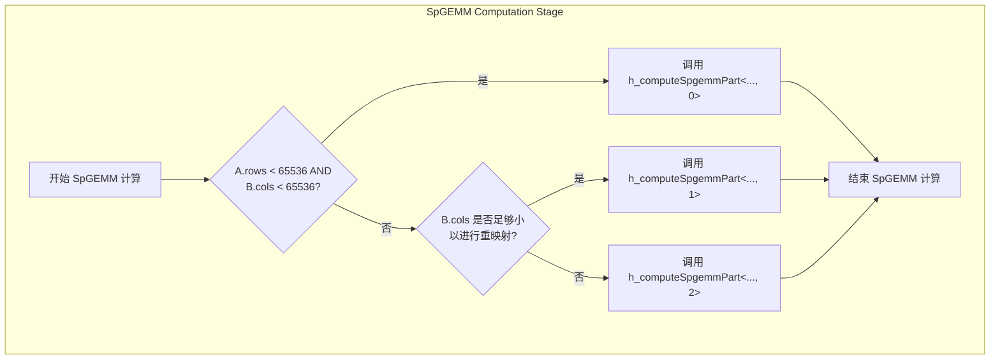
```mermaid
graph TD
    subgraph SpGEMM Computation Stage
        Start[开始 SpGEMM 计算] --> Cond1{A.rows < 65536 AND<br>B.cols < 65536?};
        Cond1 -- 是 --> Case1[调用 h_computeSpgemmPart<..., 0>];
        Cond1 -- 否 --> Cond2{B.cols 是否足够小<br>以进行重映射?};
        Cond2 -- 是 --> Case2[调用 h_computeSpgemmPart<..., 1>];
        Cond2 -- 否 --> Case3[调用 h_computeSpgemmPart<..., 2>];
        Case1 --> End[结束 SpGEMM 计算];
        Case2 --> End;
        Case3 --> End;
    end
```

*图 2: SpGEMM 内核选择逻辑。*
Sources: cuda/kernel/level3/csrspgemm_device_ac.h:35-85

这种基于矩阵维度的条件分派确保了在不同场景下的最佳性能和资源利用率，同时也增加了测试的复杂性。测试用例必须覆盖这些不同的分支以确保算法的鲁棒性。

---

## 工具脚本

### Related Pages

Related topics: [测试指南](about:blank#page-testing-guide)

- Relevant source files
    
    以下文件被用作生成此维基页面的上下文：
    
    - [hygon/test/CMakeLists.txt](hygon/test/CMakeLists.txt)
    - [arm/test/CMakeLists.txt](arm/test/CMakeLists.txt)
    - [cuda/test/CMakeLists.txt](cuda/test/CMakeLists.txt)
    - [include/alphasparse/kernel_plain/kernel_csr_c.h](include/alphasparse/kernel_plain/kernel_csr_c.h)
    - [include/alphasparse/kernel_plain/kernel_dia_c.h](include/alphasparse/kernel_plain/kernel_dia_c.h)
    - [include/alphasparse/kernel_plain/kernel_csc_c.h](include/alphasparse/kernel_plain/kernel_csc_c.h)
    - [include/alphasparse/kernel_plain/kernel_coo_c.h](include/alphasparse/kernel_plain/kernel_coo_c.h)
    - [include/alphasparse/kernel_plain/kernel_csr_z.h](include/alphasparse/kernel_plain/kernel_csr_z.h)
    - [hygon/kernel/level2/mv/symv/symv_bsr_u_lo_conj.hpp](hygon/kernel/level2/mv/symv/symv_bsr_u_lo_conj.hpp)
    - [arm/kernel/level2/mv/symv/symv_bsr_u_lo_conj.hpp](arm/kernel/level2/mv/symv/symv_bsr_u_lo_conj.hpp)
    - [include/alphasparse/kernel_dcu/kernel_bsr_c_dcu.h](include/alphasparse/kernel_dcu/kernel_bsr_c_dcu.h)
    - [include/alphasparse/kernel_dcu/kernel_csr_c_dcu.h](include/alphasparse/kernel_dcu/kernel_csr_c_dcu.h)

# 共轭（Conjugate）操作

## 简介

AlphaSparse 库为涉及复数（`ALPHA_Complex8` 和 `ALPHA_Complex16`）的稀疏矩阵计算提供了共轭（Conjugate）操作支持。此功能是稀疏 BLAS Level 2（矩阵向量运算）和 Level 3（矩阵矩阵运算）例程的一部分，特别是在处理共轭转置（Hermitian transpose）时至关重要。

共轭操作被广泛应用于多种稀疏矩阵格式，包括 CSR、CSC、BSR、DIA 和 COO，并确保在不同的硬件后端（如 x86、ARM、CUDA 和 DCU）上功能的一致性。这些操作通常通过在函数名中添加 `_conj` 后缀来标识。

## 核心功能与实现

共轭操作的核心是在进行矩阵运算时，对稀疏矩阵 `A` 的非零元素取共轭。这在计算 `alpha*A^H*x` 等表达式时是标准步骤，其中 `A^H` 代表 `A` 的共轭转置。

在 Hygon 和 ARM 平台的 BSR `symv`（对称矩阵向量乘法）内核实现中，可以看到对矩阵元素应用共轭操作的直接逻辑。

```cpp
// hygon/kernel/level2/mv/symv/symv_bsr_u_lo_conj.hpp:22-24TYPE cv = ((TYPE *)A->val_data)[s1+ai*bs*bs];cv = cmp_conj(cv);y[m_s+s/bs] = alpha_madd(cv, x[s1-s+col*bs], y[m_s+s/bs]);
```

此代码片段展示了在执行乘加操作之前，从矩阵 `A` 中提取的值 `cv` 会通过一个（推测的）`cmp_conj` 宏或函数进行处理，以计算其复共轭。

Sources: hygon/kernel/level2/mv/symv/symv_bsr_u_lo_conj.hpp:22-24, arm/kernel/level2/mv/symv/symv_bsr_u_lo_conj.hpp:22-24

## 支持的函数接口

共轭操作通过一系列带有 `_conj` 后缀的函数接口暴露给用户。这些接口涵盖了 Level 2 和 Level 3 的多种 BLAS 操作。

### Level 2 BLAS (矩阵向量运算)

- **`trmv` (Triangular Matrix-Vector Multiply)**: 计算三角稀疏矩阵与向量的乘积。
    - `trmv_c_csr_n_lo_conj_plain`
    - `trmv_z_csr_u_hi_conj_plain`
    - `dcu_trmv_c_bsr_n_lo_conj`
- **`symv` (Symmetric Matrix-Vector Multiply)**: 计算对称稀疏矩阵与向量的乘积。
    - `symv_c_dia_n_lo_conj_plain`
- **`trsv` (Triangular Solve)**: 求解三角稀疏系统 `op(A)*x = alpha*b`。
    - `trsv_c_csr_n_lo_conj_plain`
    - `trsv_c_csc_u_hi_conj_plain`
    - `trsv_c_dia_n_lo_conj_plain`

Sources: include/alphasparse/kernel_plain/kernel_csr_c.h, include/alphasparse/kernel_plain/kernel_csr_z.h, include/alphasparse/kernel_dcu/kernel_bsr_c_dcu.h, include/alphasparse/kernel_plain/kernel_dia_c.h, include/alphasparse/kernel_plain/kernel_csc_c.h

### Level 3 BLAS (矩阵矩阵运算)

- **`gemm` (General Matrix-Matrix Multiply)**: 计算稀疏矩阵与稠密矩阵的乘积。
    - `gemm_c_csr_row_conj_plain`
    - `gemm_z_csr_col_conj_plain`
- **`trmm` (Triangular Matrix-Matrix Multiply)**: 计算三角稀疏矩阵与稠密矩阵的乘积。
    - `trmm_c_dia_n_lo_row_conj_plain`
    - `trmm_z_dia_u_hi_col_conj_plain`
- **`trsm` (Triangular Solve for Matrices)**: 求解三角稀疏系统 `op(A)*X = alpha*B`。
    - `trsm_c_csr_n_lo_row_conj_plain`
    - `trsm_c_csc_u_lo_col_conj_plain`
    - `trsm_c_coo_n_hi_row_conj_plain`

Sources: include/alphasparse/kernel_plain/kernel_csr_c.h, include/alphasparse/kernel_plain/kernel_csr_z.h, include/alphasparse/kernel_plain/kernel_dia_c.h, include/alphasparse/kernel_plain/kernel_csc_c.h, include/alphasparse/kernel_plain/kernel_coo_c.h

## 平台支持与构建

该功能通过在多个目标平台上构建和链接测试可执行文件来验证。`CMakeLists.txt` 文件定义了如何为 Hygon (x86)、ARM 和 CUDA 平台编译这些测试。

下面的流程图展示了通用测试构建流程：

```mermaid
graph TD
  %% 顶层方向是 TD（从上到下），subgraph 只是分组
  subgraph Build_System
    A["CMakeLists.txt"] --> B{"add_alphasparse_example"}
  end

  subgraph Target_Platforms
    C["Hygon"]
    D["ARM"]
    E["CUDA/DCU"]
  end

  B --> C
  B --> D
  B --> E

  C --> F["spmm_csr_c_hygon_test"]
  D --> G["sv_csr_s_hygon_test"]
  E --> H["spgemm_csr_c_f32_test"]

```

例如，在 Hygon 平台上，`spmm_csr_c_hygon_test.cpp` 和 `spmm_csr_z_hygon_test.cpp` 等测试被添加，这些测试很可能用于验证复数运算（包括共轭）的正确性。

Sources: hygon/test/CMakeLists.txt:33-35, arm/test/CMakeLists.txt:30-32, cuda/test/CMakeLists.txt

## API 概览

下表总结了支持共轭操作的函数、稀疏格式和平台。

| 功能 (Function) | 格式 (Format) | 数据类型 (Data Type) | 平台 (Platform) |
| --- | --- | --- | --- |
| `trmv` | CSR, BSR | `ALPHA_Complex8`, `ALPHA_Complex16` | CPU (plain), DCU |
| `symv` | DIA, BSR | `ALPHA_Complex8` | CPU (plain) |
| `trsv` | CSR, CSC, DIA | `ALPHA_Complex8`, `ALPHA_Complex16` | CPU (plain) |
| `gemm` | CSR | `ALPHA_Complex8`, `ALPHA_Complex16` | CPU (plain) |
| `trmm` | DIA | `ALPHA_Complex8`, `ALPHA_Complex16` | CPU (plain) |
| `trsm` | CSR, CSC, COO, DIA | `ALPHA_Complex8`, `ALPHA_Complex16` | CPU (plain) |

*注意: “CPU (plain)” 指的是通用的 C/C++ 实现，可用于 Hygon 和 ARM 等平台。*

Sources: include/alphasparse/kernel_plain/kernel_csr_c.h, include/alphasparse/kernel_plain/kernel_csc_z.h, include/alphasparse/kernel_plain/kernel_dia_z.h, include/alphasparse/kernel_dcu/kernel_csr_c_dcu.h

## 总结

共轭操作是 AlphaSparse 库中处理复数稀疏矩阵运算的一项基本功能。通过在 Level 2 和 Level 3 BLAS 例程中提供广泛的支持，并覆盖多种稀疏格式和硬件平台，该库为科学与工程计算领域的用户提供了全面而强大的工具集。

---